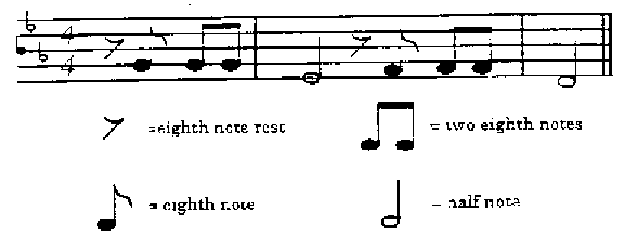

# Lab 1: Sounds and Sampling  

## Keeping Lab Records

The lab component will be assessed based on a portfolio of the Matlab scripts, Simulink models and published Matlab sessions. You should therefore aim to keep all the files from each lab session in a suitable folder in your workspace on the h:\work drive. I would suggest a structure like **EG-247-Resources\portfolio\lab01** which matches the layout of the files on this GitHub repository.

One elegant way to do this would be to fork this GitHub repository ([cpjobling/EG-247-Resources](https://github.com/cpjobling/EG-247-Resources)) and then build on from there, but that is not necessary.*

If you do not use GitHub as the master repository of your portfolio, please ensure that you backup your work files regularly. You will be required to submit some or all of them for assessment.

## Acknowledgments

This lab has been adapted from <a href="http://class.ee.iastate.edu/mmina/ee186/labs/Audio.htm" title="Audio Processing with MatLab An Introduction" target="_blank">**Audio Processing with Matlab: An Introduction**</a> by Rachel Hager from the Electrical and Computer Engineering Department at Iowa State University and Elementary Music Synthesis by Professor Virginia Stonick of Oregon State University.

This lab is an introduction to signal processing with Matlab. This lab will help to familiarize you with some of the main functions to read in and play sound files in Matlab.

It is an opportunity to try some basic digital signal processing.

You may not understand all of the underlying theory, but we shall catch up in later classes and lab exercises.

## Preparation

Download and run the <a href="https://github.com/cpjobling/EG-247-Resources/blob/master/portfolio/lab01/soundex.m" target="_blank">linked script</a> to familiarise yourself with the basic tools that Matlab provides for manipulating and visualizing audio files. You will need to download a sound file and store it in the same folder then edit the script so that it loads your file. Music might be best for this initial exercise but you can use any audio file.

You will need headphones to hear the sounds.

## [Sound Samples](http://www.ee.columbia.edu/~dpwe/sounds/) (web link)

The web link above points to a source of sound samples. Choose one of these or find some other files from the internet. I downloaded and used the file <a href="http://www.ee.columbia.edu/~dpwe/sounds/musp/msmv2.wav">Music (Vocals) Example 2</a> from <a href="http://www.ee.columbia.edu/~dpwe/sounds/musp/" target="_blank">this page</a> in my example script.

## Lab Exercise 1: Playing With Sound (2 marks)

### Part 1: Read and Store an Audio File in Matlab

To read and store an audio file, you can use one of two different commands. The following stores the file into variable x.

```matlab
x = audioread('filename');
```

Unless the audio file is in the same folder as the script, you will need to include the entire filename including the directory.

Example: `C:\My Documents\EG-247-Lab\portfolio\lab9\Audio.wav`

The command below stores the audio file into variable `x` and the sampling frequency in variable `Fs`.

```matlab
[x,Fs] = audioread('filename');
```

### Part 2: Play the Audio File

To play an audio file in Matlab you use the `sound()` function. The following function plays the sound. If the `Fs` variable is not defined or included in the command, it will assume the default sample rate of 8192 Hz.

```matlab
sound(x,Fs);
```

In the PC lab, the speakers may have been disabled. But even if they are not, it will probably be best if you use head phones with either a standard 3.5 mm phone socket or USB connection to hear the sounds.

### Part 3: Audio Scaling

To scale an audio file the `sound()` command is used. This allows for the modification of an audio signal’s amplitude or frequency.

```matlab
sound(x,Fs);
```

To increase the volume of the audio track you can multiply the variable it is stored in by a scalar. To slow down or speed up the track played you can adjust the sampling rate. Comment on your observations using different values.

Now experiment with different bit values (8,16,24) in the following command:
```matlab
sound(x,Fs,bits);
```

Comment on your observations.

### Part 4: Playing a Sound Backwards

The command to reverse the order of the samples in a matrix is `flipud()`. Experiment with this command.

Create a script called `ex01.m` that records your experiments in this part of the lab. Include your thoughts
in the comments.

## Lab Exercise 2:  Composing Music in Matlab (2 marks)

### Background

In this lab exercise, we explore how to use simple tones to compose a segment of music. By using tones of various frequencies, you will construct the first few bars of Beethoven's famous piece Symphony No. 5 in C-Minor.

**IMPORTANT**: Each musical note can be simply represented by a sinusoid whose frequency depends on the note pitch. Assume a sampling rate of 8KHz and that an eighth note = 0.125s (1000 samples).

Musical notes are arranged in groups of twelve notes called octaves. The notes that we'll be using for Beethoven's Fifth are in the octave containing frequencies from 220 Hz to 440 Hz. The twelve notes in each octave are logarithmically spaced in frequency, with each note being of a frequency $2 1/12$ times the frequency of the note of lower frequency. Thus, a 1-octave pitch shift corresponds to a doubling of the frequencies of the notes in the original octave. Table 1 shows the ordering of notes in the octave to be used to synthesize the opening of Beethoven's fifth, as well as the fundamental frequencies for these notes. Note the notes without subscripts, correspond to the white keys on a piano. The notes with subscripts - called respective sharp (♯) and flat (♭) - represent the black keys.

<table>
<thead>
<tr><td>Number</td>	<td>Note</td>	<td>Frequency (Hz)</td>	<td>Actual frequency (Hz)</td></tr>
</thead>
<tbody>
<tr><td>1</td><td>A</td><td>220</td><td>220</td></tr>
<tr><td>2</td><td>A<sup>♯</sup>,B<sup>♭</sup></td><td>220</td><td>220</td></tr>
<tr><td>3</td><td>B</td><td>220</td><td>220</td></tr>
<tr><td>4</td><td>Middle C</td><td>220</td><td>220</td></tr>
<tr><td>5</td><td>C<sup>♯</sup>,D<sup>♭</sup></td><td>220</td><td>220</td></tr>
<tr><td>6</td><td>D</td><td>220</td><td>220</td></tr>
<tr><td>7</td><td>D<sup>♯</sup>,E<sup>♭</sup></td><td>220</td><td>220</td></tr>
<tr><td>8</td><td>E</td><td>220</td><td>220</td></tr>
<tr><td>9</td><td>F</td><td>220</td><td>220</td></tr>
<tr><td>10</td><td>F<sup>♯</sup>,G<sup>♭</sup></td><td>220</td><td>220</td></tr>
<tr><td>11</td><td>G</td><td>220</td><td>220</td></tr>
<tr><td>12</td><td>G<sup>♯</sup>,A<sup>♭</sup></td><td>220</td><td>220</td></tr>
</table>
Table 1: Notes in the 220-440 Hz Octave

You should use Matlab or a calculator to complete the table.

A musical score is essentially a plot of frequencies (notes, on the vertical scale for you musician types) versus time (measures, on the horizontal scale). The musical sequence of notes to the piece you will synthesize is given in Figure 1. The following discussion identifies how musical scores can be mapped to tones of specific pitch and duration.

### Note Frequency

In the simplest case, each note may be represented by a burst of a sinusoid followed by a shorter period of silence (a pause). The pauses allow us to distinguish between separate notes of the same pitch. The horizontal lines in Figure 1 represent the notes E, G, B, D, F from the bottom to the top. The spaces between the lines are used to represent the notes F, A, C, and E, again from the bottom to the top. Note that A-G only yields seven notes; the additional notes are due to changes in pitch called sharps (denoted by the symbol ♯) or flats (denoted by the symbol ♭) that follows a given note. A sharp increases the pitch by 2 1/12 and flat decreases the pitch by 2 1/12.



Figure 1: Musical Score for Beethoven's Fifth

In the musical score in Figure 1, the first three eighth notes are all note G. The first half note is an E♭ due to the inclusion of the three flat symbols at the left of the score, since we are in the key of C-minor. After the half note, the symbol is a rest of length equal to the duration of an eighth note. The next three eighth notes are all F, and the final half note is a D. You can get the fundamental frequencies for these notes from Table 1.

### Note Durations

The duration of each note burst is determined by whether the note is a whole note, half note, quarter note, eight note, etc. Obviously, a quarter note has twice the duration of an eighth note, and so on. So your half notes should be four times the duration of your eighth notes. The short pause you use to follow each note should be of the same duration regardless of the length of the note.

### Creating Music in Matlab

This section of the lab will teach you how to create music using different tones created in Matlab.

First we are going to code a sine wave of amplitude A = 1, at an audio frequency of 220 * 7/12  Hz (which corresponds to E<sup>♭</sup>) which plays for an eighth note (0.125 seconds).

```matlab
Fs = 8000;
Ts = 1/Fs;
Eflat = sin(2*pi*(220 * (2 + 6/12))*[0:Ts:0.125]);
sound(Eflat);
```

This vector `Eflat` now contains samples of the sine wave from t = 0s to t = 0.125s, in samples that are spaced `Ts` seconds apart. Note that this sampling interval corresponds to a sampling frequency of 8 kHz (1/Ts = fs) and Ts will be 0.125 ms. This is standard for voice grade audio channels.

To create a pause use the zeros function:

```matlab
pause = zeros(1,length(0:Ts:time));
```
For example to create an eighth note pause at the start of the tune:

```matlab
pause8th = zeros(1,length(0:Ts:0.125));
```

Now to write this pause and first note sound to a sound file we use the following command:
```matlab
audiowrite('first_note.wav',[pause8th,Eflat],Fs);
```
To play the sound, use the `sound()` function.

Now you can complete the opening phrase of Beethoven's fifth by adding additional notes and pauses of the correct length.

Save the commands you use to create, play and save your version of Beethoven's Fifth in a Matlab m-file as `ex02.m` and add this to your copy of this lab script along with the sound file.

## Miniproject 1: Playing a Musical Scale (1 mark)

To demonstrate your mastery of all that you have learnt in this lab, synthesize a scale in the key of C. This is simply eight notes in order starting with C. The notes are:

C D E F G A B C

The key of C is simple because there are no sharps or flats.

To complete this mini-project you will have to define the frequencies for A, B, and the second occurrence of C since they do not appear in Table 1 in Lab Exercise 2.

* Q: What are the frequencies of the notes A, B, and the second occurrence of C?

Save your scale in an m-file called `scale.m`. The m-file should play the scale and then ALSO, PLAY IT BACKWARDS. (**Note**: Backwards does not mean flipped!). Attach your m-file to the lab portfolio before claiming your marks.


## What to hand in

You should add all the scripts and audio files created or downloaded for this exercise to your portfolio.

See <a href="https://docs.google.com/spreadsheets/d/1zBK_d1xMYvOQXlUZyGBjb9WrfZukVC6MbsXH-zSES8k/edit?usp=sharing" target="_blank">**Assessment and Feedback: Labwork Assessment**</a> for a detailed marking scheme.

----

* If you fork my repo, you should add my master repository to your upstream so that you can regularly pull and merge my updates. There's still a lot of files to be added! This [GitHub help file](https://help.github.com/articles/fork-a-repo) explains the procedure you would need to follow.
