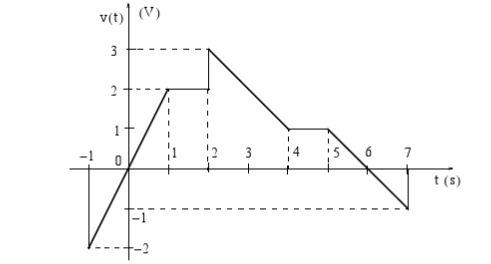

# Lab 2: Elementary Signals

## Aims

The purposes of this laboratory are to

1. Explore the properties of the unit step and Dirac delta functions using the analysis and plotting tools  provided by Matlab.
1. Synthesise a generalised signal in Simulink and plot it and its derivative.

This will introduce the symbolic toolbox and the `heaviside`, `delta` and `ezplot` functions provided by MATLAB  and the signal design block, multiplexor, scope and derivative blocks provided by Simulink for the simulation of continuous time signals and systems.

We will also demonstrate the Live Script feature provided by Matlab that will be useful for recording lab results for this module.

These examples have been adapted from Chapter 1 of
[Stephen Karris, Signals and Systems : With MATLAB
Computing and Simulink Modeling (5th Edition)](http://site.ebrary.com/lib/swansea/docDetail.action?docID=10547416)

## Set up

Navigate to the file [elem_sigs.m](https://github.com/cpjobling/EG-247-Resources/blob/master/portfolio/lab02/elem_sigs.m) in this repository. Right-click on the `Raw` button and choose `Save link as` to save a copy of `elem_sigs.m` into your lab folder. Open the file from the file browser in MATLAB as a Live Script file.

Here is a [short video](https://youtu.be/xwrZAE0D6cY), illustrating how to do this.

## Lab Exercise 3

For Lab Exercise 3 you are required to complete parts 1 to 2 of the provided script (1 mark).

## Lab Exercise 4

For Lab Exercise 4 you are required to complete parts 3 to 5 of the provided script (2 marks).

## Mini Project 2

Work through the procedures given between pages 1-18 and 1-19 of the text book to construct the piecewise signal generator first shown in Figure 1.21 inside Simulink. 

*Signal to be synthesised (Reproduction of Fig 1.21 of Karris)*

Connect the signal up a derivative block and scope as shown in Figure 1.24 and simulate the system. Verify the result illustrated in Figures 1.23, 1.25 and 1.26. Store the Simulink model as ``signal.slx`` in your portfolio for later assessment. 

**Note**: you will need to adjust the Simulation parameters in Simulink in orer to allow the simulation to run from atime earlier than $-1$ seconds.

(2 marks)

## What to Hand In

1. For the lab exercises, you should attach your completed version of the Live Script file `elem_signals.mlx`.
1. For the Miniproject the Simulink model of the piecewise linear signal `signal.slx`.

You should attach the files you wish to claim for to the Lab 2 page your EG-247 portfolio in OneNote.

## Claim

Up to three marks can be claimed according to how many of parts 1-5 in the lab exercises have been completed.
The mini project is worth an additional 2 marks.

The deadline for claims and submission is **Midnight, 26th February**.

See [Assessment and Feedback: Labwork Assessment](https://docs.google.com/spreadsheets/d/1zBK_d1xMYvOQXlUZyGBjb9WrfZukVC6MbsXH-zSES8k/edit?usp=sharing) for a detailed marking scheme.

## Doing More

If you have time remaining, you may wish to work through Appendix A of the textbook. This chapters introduce Matlab in a way that matches the presentation in the rest of the book. There are also additional tutorial and video introductions to *Matlab*, *Simulink* and the *Signal Processing Toolbox* in the **Getting Started with Matlab** folder in the Labs section of the Blackboard site for EG-247.
