# Lesson 2: Elementary Signals

## About this presentation

Dr Chris Jobling
([c.p.jobling@swansea.ac.uk](mailto:c.p.jobling@swansea.ac.uk))

Digital Technium 123

Office Hours: ...

You can view the notes for this presentation in
[HTML](http://cpjobling.github.io/EG-247-Resources/week1/elementary_signals.html)
and
[PDF](http://cpjobling.github.io/EG-247-Resources/week1/elementary_signals.pdf).

The source code of this presentation is available in Markdown format from GitHub:
[Introduction.md](https://github.com/cpjobling/EG-247-Resources/tree/master/week1/elementary_signals.md).

The GitHub repository [EG-247 Resources](https://github.com/cpjobling/EG-247-Resources)
also contains the source code for all the Matlab/Simulink
examples.

## Review of Homework Problem from Lesson 1

Consider a signal

$$x = f(t) = \left\{ {\begin{array}{*{20}{c}}
{0\;:\;t <  - 1}\\
{t + 1\;:\; - 1 \le t \le 1}\\
{0\;:\;t > 1}
\end{array}} \right.$$

Sketch this signal

----

Sketch the effect on this signal of applying the following
basic signal operations

### Amplitude scaling

* $2 f(t)$
* $0.5 f(t)$

### Time scaling

* $f(2t)$
* $f(0.5 t)$

### Mirroring

* $-f(t)$
* $f(-t)$
* $-f(-t)$

### Time shifting - delay and advance

* $f(t - 1)$
* $f(t + 1)$

----

## Try this

### A combination of transformations

* $-2f(-t+2)$

Note that this involves *amplitude scaling*, *amplitude mirroring*, *time mirroring*, and a
*time shift*. Each operation can be performed in sequence in any order.

----

### Sketch of signal


### Amplitude scaling


### Time scaling


### Mirroring


### Time shifting - delay and advance


## Quiz: consider this circuit:

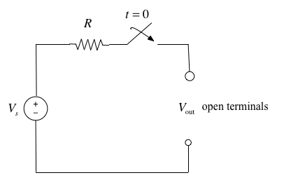

# Elementary signals

## Unit Step Function

### Definition

$${u_0}(t) = \left\{ {\begin{array}{*{20}{c}}
{0\quad t < 0}\\
{1\quad t > 0}
\end{array}} \right.$$

----

## Sketch

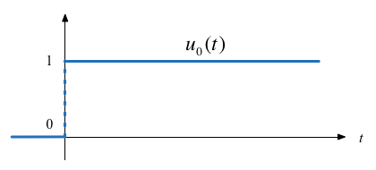

## Computing/Plotting in Matlab

In Matlab, we use the `heaviside` function (Named after [Oliver
Heaviside](http://en.wikipedia.org/wiki/Oliver_Heaviside)).

```matlab
syms t
ezplot(heaviside(t),[-1,1])
```

See: [heaviside_function.m](files/matlab/heaviside_function.m)


----

## Result

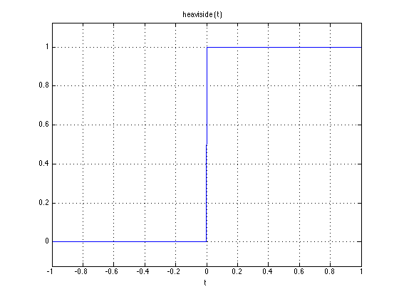

<div class="notes">
Note that, so it can be plotted, Matlab defines the *heaviside function*
slightly differently from the mathematically ideal unit step:

$$\mathrm{heaviside}(t) = \left\{ {\begin{array}{*{20}{c}}
{0\quad t < 0}\\
{1/2\quad t = 0}\\
{1\quad t > 0}
\end{array}} \right.$$
</div>

## Circuit Revisited

Consider the network shown below, where the switch is closed at time $t=T$.

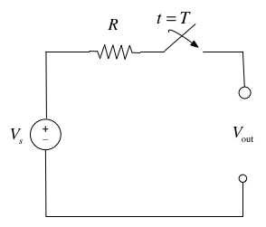

----

Express the output voltage $v_{\mathrm{out}}$ as a function of the unit step
function, and sketch the appropriate waveform.

# Simple Signal Operations

## Amplitude Scaling

Sketch $Au_0(t)$ and $-Au_0(t)$

## Time Reversal

Sketch $u_0(-t)$

## Time Delay and Advance

Sketch $u_0(t-T)$ and $u_0(t+T)$

## Example 1

Which of these signals represents $-Au_0(t+T)$?

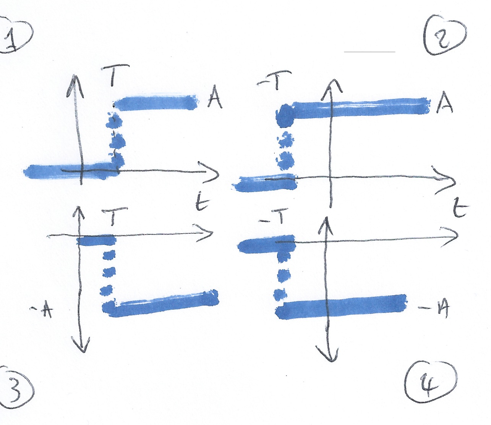

## Example 2

What is represented by

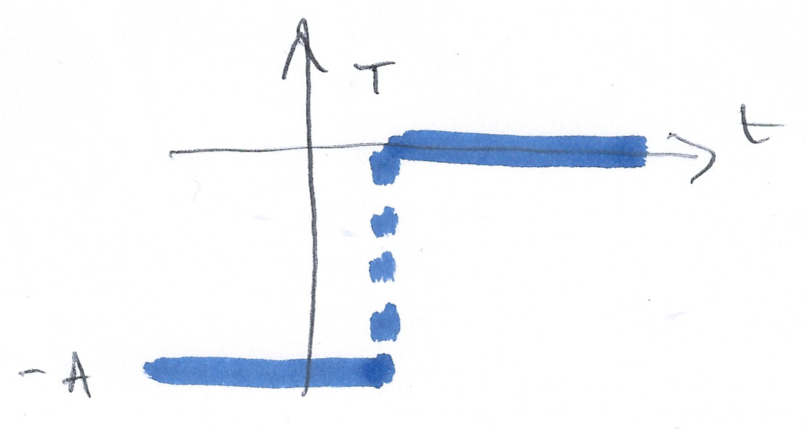

----

1. $-Au_0(t - T)$
2. $-Au_0(-t + T)$
3. $-Au_0(-t - T)$
4. $-Au_0(t-T)$

## Synthesis of Signals from Unit Step

Unit step functions can be used to represent other time-varying functions such
as rectangular pulses, square waves and triangular pulses.

## Synthesize Rectangular Pulse

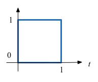

## Synthesize Square Wave

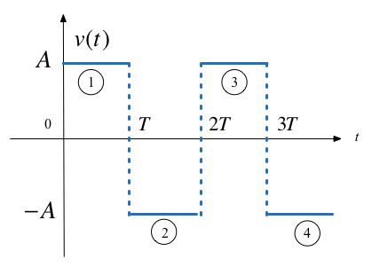

## Synthesize Symmetric Rectangular Pulse

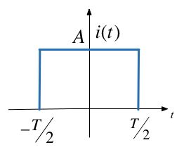

## Synthesize Symmetric Triangular Pulse


## Homework

Show that the waveform shown below

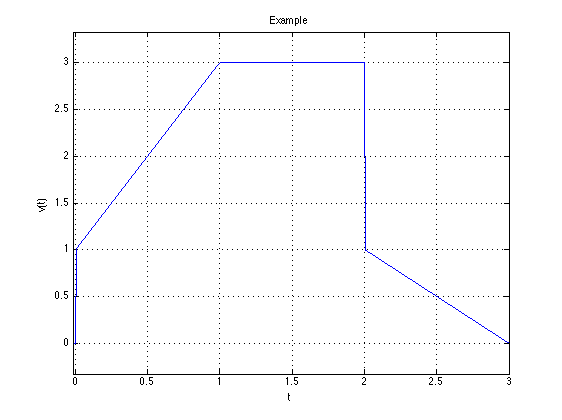

---

can be represented by the function

$$v(t) = (2t + 1)u_0(t)-2(t-1)u_0(t-1)-tu_0(t-2)+(t-3)u_o(t-3)$$

## The Ramp Function

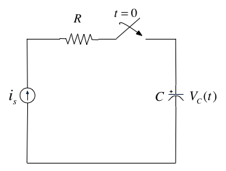

---

In the circuit shown in the previous slide $i_s$ is a constant current source and the switch is
closed at time $t=0$. Show that the voltage across the capacitor can be
represented as

$$v_C(t)=\frac{i_s}{C}t u_0(t)$$

and sketch the wave form.

----

## The unit ramp function

The unit ramp function is defined as

$$u_1(t) = \int_{-\infty}^{t}u_0(\tau)d\tau$$

so

$${u_1}(t) = \left\{ {\begin{array}{*{20}{c}}
{0\quad t < 0}\\
{t\quad t \ge 0}
\end{array}} \right.$$

and

$$u_0(t) = \frac{d }{dt}u_1(t)$$

<div class="notes">
<h3>Note</h3>

Higher order functions of $t$ can be generated by the repeated integration of
the unit step function.

For future reference, you should determine $u_2(t)$, $u_3(t)$ and $u_n(t)$ for
yourself and make a note of the general rule:

$$u_{n-1} = \frac{1}{n}\frac{d}{dt}u_n(t)$$

Details are given in equations 1.26&mdash;1.29 in the textbook.
</div>

## The Dirac Delta Function

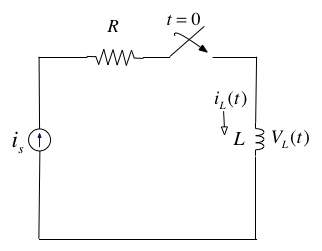

----

In the circuit shown on the previous slide, the switch is closed at time $t=0$ and $i_L(t)=0$
for $t<0$. Express the inductor current $i_L(t)$ in terms of the unit step
function and hence derive an expression for $v_L(t)$.

<div class="notes">
<h3>Note</h3>

To solve this problem we need to invent a function that represents the
derivative of the unit step function. This function is called $\delta(t)$ or the
*dirac delta* function (named after [Paul
Dirac](http://en.wikipedia.org/wiki/Paul_Dirac)).

</div>

## The delta function

The *unit impulse* or the *delta function*, denoted as $\delta(t)$, is the derivative of the unit step.

This function is tricky because $u_0(t)$ is discontinuous at $t=0$ but it must
have the properties

$$\int_{-\infty}^{t}\delta(\tau)d\tau = u_0(t)$$

and

$\delta(t) = 0$ for all $t\ne 0$.

## Sketch of the delta function

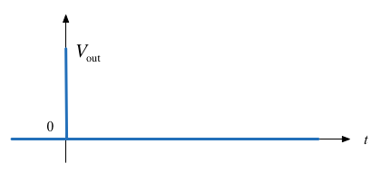

# Important properties of the delta function

## Sampling Property

The *sampling property* of the delta function states that

$$f(t)\delta(t-a) = f(a)\delta(t-a)$$

or, when $a = 0$,

$$f(t)\delta(t) = f(0)\delta(t)$$

Multiplication of any function $f(t)$ by the delta function $\delta(t)$ results
in sampling the function at the time instants for which the delta function is
not zero.

The study of descrete-time (sampled) systems is based on this property.

*You should work through the proof* for youself.

## Sifting Property

The *sifting property* of the delta function states that

$$\int_{-\infty}^{\infty}f(t)\delta(t-\alpha)dt=f(\alpha)$$

That is, if multiply any function $f(t)$ by $\delta(t-\alpha)$, and integrate
from $-\infty$ to $+\infty$, we will get the value of $f(t)$ evaluated at
$t=\alpha.$

*You should also work through the proof* for yourself.

## Higher Order Delta Fuctions

the n*th*-order *delta function* is defined as the n*th* derivative of $u_0(t)$,
that is

$$\delta^n(t)=\frac{d^n}{dt^n}[u_0(t)]$$

The function $\delta'(t)$ is called the *doublet*, $\delta''(t)$ is called the
*triplet* and so on.

----

By a procedure similar to the derivation of the sampling property we can show
that

$$f(t)\delta'(t-a)=f(a)\delta'(t-a)-f'(t)\delta(t-a)$$

----

Also, derivation of the sifting property can be extended to show that

$$\int_{-\infty}^{infty}f(t)\delta^n(t-\alpha)dt = {\left. {{{( -
1)}^n}\frac{{{d^n}}}{{d{t^n}}}[f(t)]} \right|_{t = \alpha }}$$

----

# Examples

## Example 3

Evaluate the following expressions

1. $$3t^4\delta(t-1) $$
2. $$\int_{-\infty}^{\infty}t\delta(t-2)dt$$
3. $$t^2\delta'(t-3)$$


## Example 4

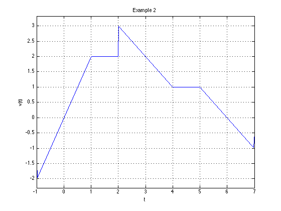

1. Express the voltage waveform $v(t)$ shown above aa sum of unit step functions
for the time interval $-1 < t < 7$ s

2. Using the result of part (1), compute the derivative of $v(t)$ and sketch
it's waveform.

# Self-study

Do the end of the chapter exercises (Section 1.7) from the textbook. Don't look
at the answers until you have attempted the problems.

# Lab Work

In the lab, a week on Friday, we will solve Example 2 using Matlab/Simulink following
the procedure given between pages 1-17 and 1-22 of the textbook. We
will also explore the `heaviside` and `dirac` functions.
