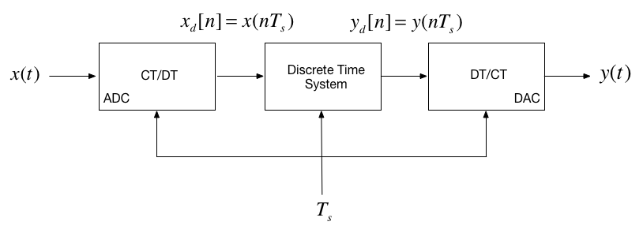
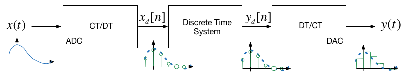
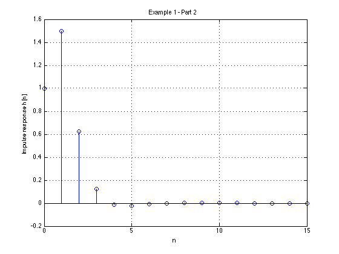
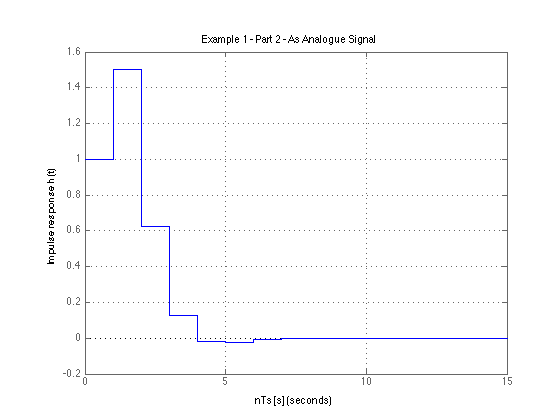
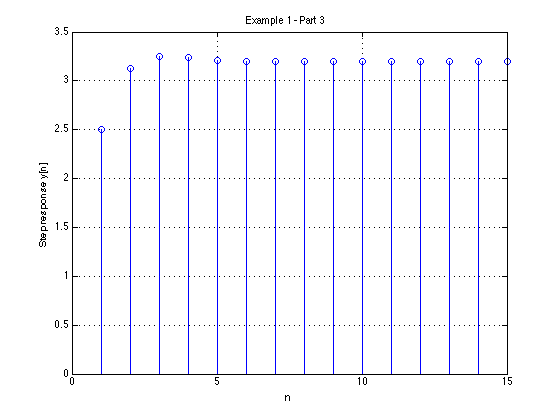
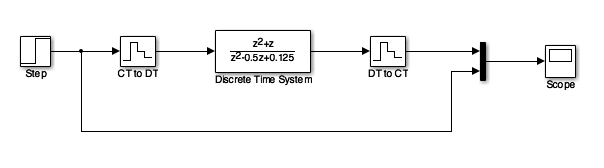
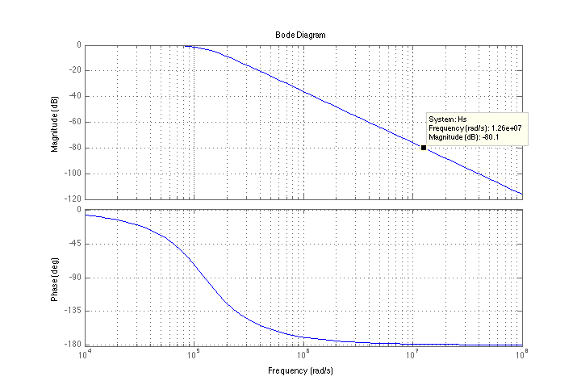
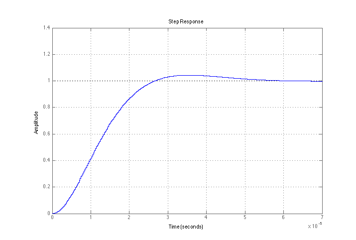

# Discrete-Time System Models

Dr Chris Jobling ([c.p.jobling@swansea.ac.uk](mailto:c.p.jobling@swansea.ac.uk))

Digital Technium 123

Office Hours: 12:00-13:00 Mondays

You can view the notes for this presentation in [HTML](http://cpjobling.github.io/EG-247-Resources/week10/dt-models.html
  ) and [PDF](http://cpjobling.github.io/EG-247-Resources/week10/dt-models.pdf).

  The source code of this presentation is available in Markdown format from GitHub: [dt-models.md](https://github.com/cpjobling/EG-247-Resources/tree/master/week10/dt-models.md).

The GitHub repository [EG-247 Resources](https://github.com/cpjobling/EG-247-Resources)
also contains the source code for all the Matlab/Simulink
examples and the Laboratory Exercises.


## Scope and Background Reading

This session we will explore digital systems and learn more about the z-transfer
function model.

The material in this presentation and notes is based on Chapter 9 (Starting at
Section 9.7) of [Steven T. Karris, Signals and Systems: with Matlab Computation
and Simulink Modelling, 5th
Edition.](http://site.ebrary.com/lib/swansea/docDetail.action?docID=10547416)
from the **Required Reading List**. I have skipped the section on digital state-
space models.

## Agenda

* Discrete Time Systems
* Transfer Functions in the Z-Domain
* Modelling digital systems in Matlab/Simulink
* Continuous System Equivalents
* Example: Digital Butterworth Filter

## Discrete Time Systems

In the lecture that introduced the z-transform we talked about the
representation of a discrete-time (DT) system by the model shown below:



In this session, we want to explore the contents of the central block.

## DT System as a Sequence Processor

* As noted in the previous slide, the discrete time system takes as an input the
sequence $x_d[n]$[^1]</sup>.
* It produces another sequence $y_d[n]$ by *processing* the input sequence in
some way.
* The output sequence is converted into an analogue signal $y(t)$ by a digital
to analogue converter.



## What is the nature of the DTS?

* The discrete time system (DTS) is a block that converts a sequence $x_d[n]$
into another sequence $y_d[n]$
* The transformation will be a *difference equation* $h[n]$

* By analogy with CT systems, $h[n]$ is the impulse response of the DTS, and
$y[n]$ can be obtained by *convolving* $h[n]$ with $x_d[n]$ so:

$$y_d[n] = h[n] * x_d[n]$$

----

* Taking the z-transform of $h[n]$ we get $H(z)$, and from the transform
properties, convolution of the signal $x_d[n]$ by system $h[n]$ will be
*multiplication* of the z-transforms:

$$Y_d(z) = H(z) X_d(z)$$

* So, what does $h[n]$ and therefore $H(z)$ look like?

# Transfer Functions in the z-Domain
## Transfer Functions in the z-Domain

Let us assume that the sequence transformation is a *difference equation* of the
form[^2]:

$$\begin{array}{l}
y[n] + {a_1}y[n - 1] + {a_2}y[n - 2] +  \cdots  + {a_k}y[n - k]\\
\quad  = {b_0}x[n] + {b_1}x[n - 1] + {b_2}x[n - 2] +  \cdots  + {b_k}x[n - k]
\end{array}$$

## Take Z-Transform of both sides

From the z-transform properties

$$f[n-m] \Leftrightarrow z^{-m}F(z)$$

so....

$$Y(z) + a_1z^{-1}Y(z) + a_2z^{-2}Y(z) + \cdots + a_kz^{-k}Y(z) = ...$$

$$b_0 X(z) + b_1z^{-1}X(z) + b_2z^{-2}X(z) + \cdots + b_kz^{-k}X(z)$$

## Gather terms

$$\begin{array}{l}
\left( {1 + {a_1}{z^{ - 1}} + {a_2}{z^{ - 2}} +  \cdots {a_k}{z^{ - k}}}
\right)Y(z) = \\
\quad \left( {{b_0} + {b_1}{z^{ - 1}} + {b_2}{z^{ - 2}} +  \cdots {b_k}{z^{ -
k}}} \right)X(z)
\end{array}$$

from which ...


$$Y(z) = \left(\frac{b_0 + b_{1}z^{-1} + b_{2}z^{-2} + \cdots b_{k}z^{-k}}{1 +
a_{1}z^{-1} + a_{2}z^{-2} + \cdots a_{k}z^{-k}
}\right) X(z)$$

## Define transfer function

We define the *discrete time transfer function* $H(z) := Y(z)/U(z)$ so...

$$H(z) = \frac{Y(z)}{X(z)} = \frac{b_0 + b_{1}z^{-1} + b_{2}z^{-2} + \cdots
b_{k}z^{-k}}{1 + a_{1}z^{-1} + a_{2}z^{-2} + \cdots a_{k}z^{-k}
}$$


... or more conventionally[^3]:

$$H(z) = \frac{b_0z^k + b_{1}z^{k-1} + b_{2}z^{k-2} + \cdots b_{k-1}z +
b_{k}}{z^k + a_{1}z^{k-1} + a_{2}z^{k-2} + \cdots a_{k-1} z + a_{k}}$$

<div class="notes">
[^1]: In our context this will be the sequence of sampled values generated by the ADC.

[^2]: A difference equation for a sequence based on regular sampling consists of
a linear combination of the current and past values of the sequences of the dependent
and independent variables and in this sense it is analogous to a linear differential equation.

[^3]: We more conventially see transfer functions defined in positive powers of the transform variable.
</div>

## DT impulse response

The *discrete-time impulse reponse* $h[n]$ is the response of the DT system to
the input $x[n] = \delta[n]$

Last week we showed that $\mathcal{Z}\left\{\delta[n]\right\}$ was defined by
the transform pair

$$\delta[n] \Leftrightarrow ?$$

----

$$\delta[n] \Leftrightarrow 1$$

----

so

$$h[n] = ...$$

----

$$h[n] = \mathcal{Z}^{-1}\left\{H(z).1\right\} =
\mathcal{Z}^{-1}\left\{H(z)\right\}$$

## Example 1

Karris Example 9.10:

The difference equation describing the input-output relationship of a DT system
with zero initial conditions, is:

$$y[n] - 0.5 y[n-1] + 0.125 y[n-2] = x[n] + x[n -1]$$

Compute:

1. The transfer function $H(z)$
2. The DT impulse response $h[n]$
3. The response $y[n]$ when the input $x[n]$ is the DT unit step $u_0[n]$

## 1. The transfer function

$$H(z) = \frac{Y(z)}{U(z)} = ...?$$

## 1. Solution

$$H(z) = \frac{Y(z)}{X(z)} = \frac{z^2 + z}{z^2 - 0.5z + 0.125}$$

## 2. The DT impulse response

Start with:

$$\frac{H(z)}{z} = \frac{z - 1}{z^2 + 0.5 z + 0.125}$$

## 2. Solution

$$h[n] = {\left( {\frac{{\sqrt 2 }}{4}} \right)^n}\left( {\cos \left(
{\frac{{n\pi }}{4}} \right) + 5\sin \left( {\frac{n\pi }{4}} \right)} \right)$$


## Matlab Solution

See [dtm_ex1_2.m](https://github.com/cpjobling/EG-247-Resources/blob/master/week10/matlab/dtm_ex1_2.m):



----



## 3. The DT step response

$$Y(z) = H(z)X(z)$$

$$u_0[n] \Leftrightarrow \frac{z}{z - 1}$$

$$\begin{array}{lcl}
Y(z) = H(z){U_0}(z) &=& \frac{{{z^2} + z}}{{{z^2} + 0.5z + 0.125}}.\frac{z}{{z -
1}}\\
 & = & \frac{{z({z^2} + z)}}{{({z^2} + 0.5z + 0.125)(z - 1)}}
\end{array}$$

$$\frac{Y(z)}{z} = \frac{z^2 + z}{(z^2 + 0.5 z + 0.125)(z - 1)}$$

## 3. Solution

$$y[n] = \left(3.2 - {\left( {\frac{{\sqrt 2 }}{4}} \right)^n}\left( {2.2 \cos
\left( {\frac{{n\pi }}{4}} \right) + 0.6\sin \left( {\frac{n\pi }{4}} \right)}
\right)\right) u_0[n]$$

## Matlab Solution

See [dtm_ex1_3.m](https://github.com/cpjobling/EG-247-Resources/blob/master/week10/matlab/dtm_ex1_3.m):




# Modelling DT systems in Matlab and Simulink

## Matlab

Code extracted from [dtm_ex1_3.m](https://github.com/cpjobling/EG-247-Resources/blob/master/week10/matlab/dtm_ex1_3.m):

```matlab
Ts = 1;
z = tf('z', Ts)
Hz = (z^2 + z)/(z^2 - 0.5 * z + 0.125)
step(Hz)
grid
title('Example 1 - Part 3 - As Analogue Signal')
xlabel('nTs [s]')
ylabel('Step response y(t)')
axis([0,15,0,3.5])
```

----


## Simulink Model

See [dtm.slx](https://github.com/cpjobling/EG-247-Resources/blob/master/week10/matlab/dtm.slx):



----


# Converting Continuous Time Systems to Discrete Time Systems
## Converting Continuous Time Systems to Discrete Time Systems

* In analogue electronics, to implement a filter we would need to resort to op-
amp circuits with resistors, capacitors and inductors acting as energy
dissipation, storage and release devices.
* In modern digital electronics, it is often more convenient to take the
original transfer function $H(s)$ and produce an equivalent $H(z)$.
* We can then determine a *difference equation* that will respresent $h[n]$ and
implement this as *computer algorithm*.
* Simple storage of past values in memory becomes the repository of past state
rather than the integrators and derivative circuits that are needed in the
analogue world.
* To achieve this, all we need is to be able to do is to *sample* and *process*
the signals quickly enough to avoid violating Nyquist-Shannon's sampling
theorem.

## Continuous System Equivalents

* There is no digital system that uniquely represents a continuous system
* This is because as we are sampling, we only have knowledge of signals being
processed at the sampling instants, and need to *reconstruct* the inter-sample
behaviour.
* In practice, only a small number of transormations are used.
* The derivation of these is beyond the scope of this module, but we'll mention
the ones that Matlab provides in a function called `c2d`

## Matlab c2d function

This is what the help function says:

    >> help c2d
    SYSD = c2d(SYSC,TS,METHOD) computes a discrete-time model SYSD with
        sampling time TS that approximates the continuous-time model SYSC.
        The string METHOD selects the discretization method among the following:
           'zoh'       Zero-order hold on the inputs
           'foh'       Linear interpolation of inputs
           'impulse'   Impulse-invariant discretization
           'tustin'    Bilinear (Tustin) approximation.
           'matched'   Matched pole-zero method (for SISO systems only).
        The default is 'zoh' when METHOD is omitted. The sampling time TS should
        be specified in the time units of SYSC (see "TimeUnit" property).
    ...

## Example 2

* Design a 2nd-order butterworth anti-aliasing filter with transfer function
$H(s)$ for use in sampling music.
* The cut-off frequency $\omega_c = 20$&nbsp;kHz and the filter should have an
attenuation of at least $-80$&nbsp;dB in the stop band.
* Choose a suitable sampling frequency for the audio signal and give the
transfer function $H(z)$ and an algorithm to implement $h[n]$

## Solution

See [digi_butter.m](https://github.com/cpjobling/EG-247-Resources/blob/master/week10/matlab/dtm_ex1_2.m/digi_butter.m):

$$\omega_c = 2\pi f_c = 2\times \pi \times 20\times 10^3  = 125.6637\times
10^3\;\mathrm{rad/s}$$

From the lecture on filters, we know the 2nd-order butterworth filter has
transfer function:

$$H(s) = \frac{{Y(s)}}{{U(s)}} = {\rm{ }}\frac{{\omega _c^2}}{{{s^2} + {\omega
_c}\sqrt 2 \,s + \omega _c^2}}$$

Substituting for $\omega_c = 125.6637\times 10^3$ this is ...?

----

$$H(s) = \frac{{15.79 \times {{10}^9}}}{{{s^2} + 177.7 \times {{10}^3}s + 15.79
\times {{10}^9}}}$$


## Bode plot

Matlab:

```matlab
wc = 2*pi*20e3;
Hs = tf(wc^2,[1 wc*sqrt(2), wc^2]);
bode(Hs,{1e4,1e8})
grid
```

----



## Sampling Frequency

From the bode diagram, the frequency at which $|H(j\omega)|$ is $-80$&nbsp;dB is
approx $12.6\times 10^6$&nbsp;rad/s.

To avoid aliasing, we should choose a sampling frequency twice this = ?

So sampling frequency $\omega_s = 2\times 12.6\times 10^6 = 25.2\times
10^6$&nbsp;rad/s.

Sampling frequency in Hz $f_s$ = ?

----

$$f_s = \omega_s/(2\pi) = 25.2\times 10^6/(2\times \pi) = 40.1\;\mathrm{Mhz}$$

----

Sampling time $T_s = ?$

----

$$T_s = 1/f_s \approx 0.25\;\mu\mathrm{s}$$

## Digital Butterworth


    >> Hz = c2d(Hs, Ts) % zero-order-hold equivalent

    Hz =

      0.0004836 z + 0.0004765
      -----------------------
      z^2 - 1.956 z + 0.9567

    Sample time: 2.4933e-07 seconds
    Discrete-time transfer function.

## Step response



## Algorithm

From previous result:

$$H(z) = \frac{Y(z)}{U(z)} = \frac{486.6\times 10^{-6}z +  476.5\times
10^{-6}}{z^2 - 1.956z + 0.9567}$$

Dividing top and bottom by $z^2$ ...

$$H(z) = \frac{Y(z)}{U(z)} = \frac{486.6\times 10^{-6}z^{-1} +  476.5\times
10^{-6}z^{-2}}{1 - 1.956z^{-1} + 0.9567z^{-2}}$$

expanding out ...

$$\begin{array}{l}
Y(z) - 1.956{z^{ - 1}}Y(z) + 0.9567{z^{ - 2}}Y(z) = \\
\quad 486.6 \times {10^{ - 6}}{z^{ - 1}}U(z) + 476.5 \times {10^{ - 6}}{z^{ -
2}}U(z)
\end{array}$$

## Algorithm ... continued

Inverse z-transform gives ...


$$\begin{array}{l}
y[n] - 1.956y[n - 1] + 0.9567y[n - 2] = \\
\quad 486.6 \times {10^{ - 6}}u[n - 1] + 476.5 \times {10^{ - 6}}u[n - 2]
\end{array}$$

in algorithmic form (compute $y[n]$ from past values of $u$ and $y$) ...

$$\begin{array}{l}
y[n] = 1.956y[n - 1] - 0.9567y[n - 2] + 486.6 \times {10^{ - 6}}u[n - 1] + ...\\
\quad 476.5 \times {10^{ - 6}}u[n - 2]
\end{array}$$

## Convert to code

To implement:
$$\begin{array}{l}
y[n] = 1.956y[n - 1] - 0.9567y[n - 2] + 486.6 \times {10^{ - 6}}u[n - 1] + ...\\
\quad 476.5 \times {10^{ - 6}}u[n - 2]
\end{array}$$

```c
/* Initialize */
ynm1 = 0; ynm2 = 0; unm1 = 0; unm2 = 0;
while (true) {
  un = read_adc;
  yn = 1.956 * ynm1
       - 0.9567 * ynm2
       + 486.6e-6 * unm1
       + 476.5e-6 * unm2;
  write_dac(yn);
  /* store past values */
  ynm2 = ynm1; ynm1 = yn;
  unm2 = unm1; unm1 = un;
}
```

## Comments

PC soundcards can sample audio at 44.1 kHz so this implies that the anti-
aliasing filter is much sharper than this one as $f_s/2 = 22.05$ kHz.

You might wish to find out what order butterworth filter would be needed to have
$f_c = 20$ kHz and $f_{\mathrm{stop}}$ of 22.05 kHz.

## Summary

* Discrete Time Systems
* Transfer Functions in the Z-Domain
* Modelling digital systems in Matlab/Simulink
* Continuous System Equivalents
* Example: Digital Butterworth Filter

## The End?

* This concludes this module.
* There is some material that I have not covered, most notably **Discrete
Fourier Transform**.
* This is covered in Karris Chapter 10 and Boulet. It will not be examined this
year!
* There is a significant amount of additional information about **Filter
Design** (including the use of Matlab for this) in Chapter 11 of Karris.

## Homework

You should be able to tackle the remaining end of chapter exercises 8-11
(Section 9.10) from Karris. Don't look at the answers until you have attempted
the problems.
