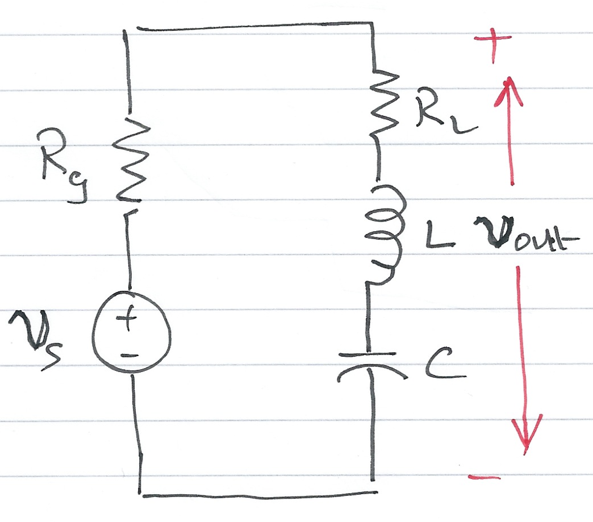
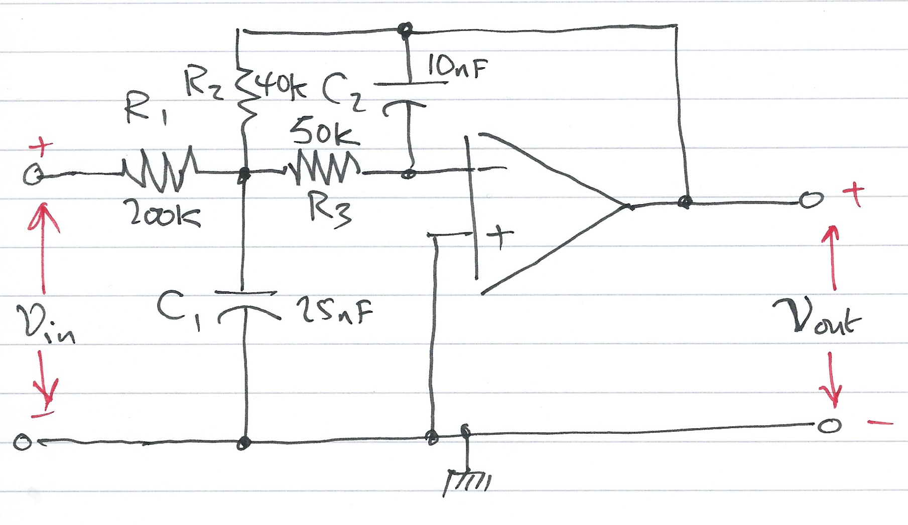
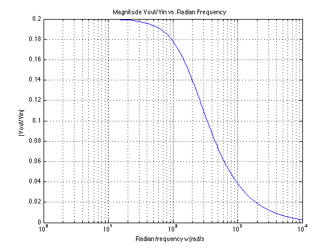
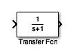

# Transfer Functions

Dr Chris Jobling ([c.p.jobling@swansea.ac.uk](mailto:c.p.jobling@swansea.ac.uk))

Digital Technium 123

Office Hours: 12:00-13:00 Mondays

You can view the notes for this presentation in [HTML](http://cpjobling.github.io/EG-247-Resources/week3/transfer_functions.html
  ) and [PDF](http://cpjobling.github.io/EG-247-Resources/week3/transfer_functions.pdf).

  The source code of this presentation is available in Markdown format from GitHub: [transfer_functions.md](https://github.com/cpjobling/EG-247-Resources/tree/master/week3/transfer_functions.md).

The GitHub repository [EG-247 Resources](https://github.com/cpjobling/EG-247-Resources)
also contains the source code for all the Matlab/Simulink
examples and the Laboratory Exercises.

## This Week

This week's sessions are based on Chapter 4 **Circuit Analysis with Laplace
Transforms** from Steven T. Karris [Signals and Systems: with MATLAB Computing
and Simulink Modelling (5th
Edition)](http://site.ebrary.com/lib/swansea/docDetail.action?docID=10547416)
[You need University Login to access]

## Last Time

Last time we showed how Laplace and Inverse-Laplace Transforms could be used to
model circuits and to analyse their responses to simple signals. We also
introduced the idea of *complex impedence* and *complex admittance*.

## This Time

This time we will examine the idea of a *Transfer Function* which opens up
signals and systems analysis to a whole range of additional possibilities
including

* block diagram modelling
* numerical simulation
* numerical analysis and the
* fundamental ideas of *Signal Processing*.

## Agenda

* Transfer Functions
* A Couple of Examples
* Circuit Analysis Using MATLAB LTI Transfer Function Block
* Circuit Simulatiom Using Simulink Transfer Function Block

## Transfer Functions for Circuits

When doing circuit analysis with components defined in the complex frequency
domain, the ratio of the output voltage $V_{\mathrm{out}}(s)$ ro the input
voltage $V_{\mathrm{in}}(s)$ *under zero initial conditions* is of great
interest. This ratio is known as the *voltage transfer function* denoted
$G_v(s)$:

$$G_v(s) = \frac{V_{\mathrm{out}}(s)}{V_{\mathrm{in}}(s)}$$

Similarly, the ratio of the output current $I_{\mathrm{out}}(s)$ to the input
current $I_{\mathrm{in}}(s)$ *under zero initial conditions*, is called the
*cuurent transfer function* denoted $G_i(s)$:

$$G_i(s) = \frac{I_{\mathrm{out}}(s)}{I_{\mathrm{in}}(s)}$$

----

In practice, the current transfer function is rarely used, so we will use the
voltage transfer function denoted:

$$G(s) = \frac{V_{\mathrm{out}}(s)}{V_{\mathrm{in}}(s)}$$

## Example 6

Derive an expression for the transfer function $G(s)$ for the circuit below. In
this circuit $R_g$ represents the internal resisteance of the applied (voltage)
source $v_s$, and $R_L$ represents the resistance of the load that consists of
$R_L$, $L$ and $C$.

----

## Sketch of Solution

* Replace $v_s(t)$, $R_g$, $R_L$, $L$ and $C$ by their transformed (*complex
frequency*) equivalents: $V_s(s)$, $R_g$, $R_L$, $sL$ and $1/(sC)$
* Use the *Voltage Divider Rule* to determine $V_\mathrm{out}(s)$ as a function
of $V_s(s)$
* Form $G(s)$ by writing down the ratio $V_\mathrm{out}(s)/V_s(s)$

## Example 7

Compute the transfer function for the op-amp circuit shown below in terms of the
circuit constants $R_1$, $R_2$, $R_3$, $C_1$ and $C_2$. Then replace the complex
variable $s$ with $j\omega$, and the circuit constants with their numerical
values and plot the magnitude $\left|G(s)\right| =
\left|V_\mathrm{out}(s)/V_\mathrm{in}(s)\right|$ versus radian frequency
$\omega$.

----

## Sketch of Solution

* Replace the components and voltages in the circuit diagram with their complex
frequency equivalents
* Use nodal analysis to determine the voltages at the nodes either side of the
50K resistor $R_3$
* Note that the voltage at the input to the op-amp is a virtual ground
* Solve for $V_\mathrm{out}(s)$ as a function of $V_\mathrm{in}(s)$
* Form the reciprocal $G(s) = V_\mathrm{out}(s)/V_\mathrm{in}(s)$
* Use MATLAB to calculate the component values, then replace $s$ by $j\omega$.
* Plot $\left|G(j\omega)\right|$ on log-linear "paper"

## The Matlab Bit

See attached script: [solution7.m](matlab/solution7.m).

## Using Transfer Functions in Matlab for System Analysis

Please use the file [tf_matlab.m](matlab/tf_matlab.m) to explore the
Transfer Function features provide by Matlab. Use the *publish* option to
generate a nicely formatted document.

## Using Transfer Functions in Simulink for System Simulation

----

The Simulink transfer function (**`Transfer Fcn`**) block shown above implements
a transfer function representing a general
input output function

$$G(s) = \frac{N(s)}{D(s)}$$

that it is not specific nor restricted to circuit analysis. It can, however be
used in modelling and simulation studies.

## Example

Recast Example 7 as a Matlab problem using the LTI Transfer Function block. For
simplicity use parameters $R_1 = R_2 = R_3 = 1\; \Omega$, and $C_1 = C_2 =
1\;\mathrm{F}$. Calculate the step response using the LTI functions.

The Matlab solution: [example8.m](matlab/example8.m)

Verify the result with Simulink.

## Homework

Do the end of the chapter exercises (Questions 5-7 from Section 4.7) from the
textbook. Don't look at the answers until you have attempted the problems.

## Lab Work

In the lab, a week on Friday, we will get you to play with using Matlab to solve
circuit problems, build transfer functions, use transfer functions with the
system analysis tools and the Simulink simulation tools. At the end of this
exercise, you should be able to do Question 9 from the End of Chapter Problems
Section 4.7).
