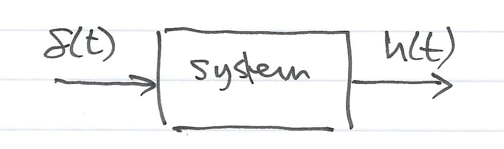
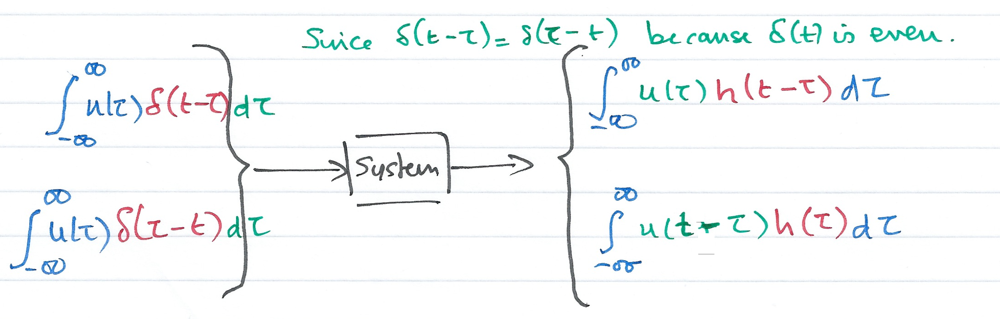
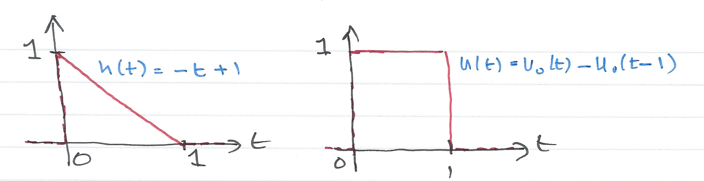
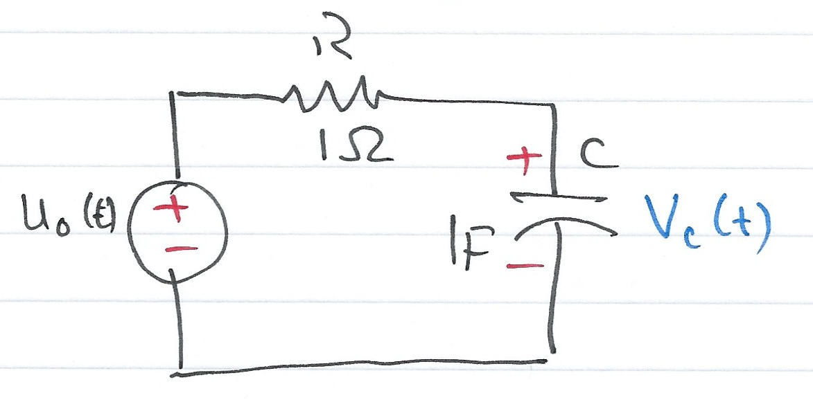

# The Impulse Response and Convolution (Part 2)

Dr Chris Jobling ([c.p.jobling@swansea.ac.uk](mailto:c.p.jobling@swansea.ac.uk))

Digital Technium 123

Office Hours: 12:00-13:00 Mondays

You can view the notes for this presentation in [HTML](http://cpjobling.github.io/EG-247-Resources/week5/convolution.html
  ) and [PDF](http://cpjobling.github.io/EG-247-Resources/week5/convolution.pdf).

  The source code of this presentation is available in Markdown format from GitHub: [convolution.md](https://github.com/cpjobling/EG-247-Resources/tree/master/week5/convolution.md).

The GitHub repository [EG-247 Resources](https://github.com/cpjobling/EG-247-Resources)
also contains the source code for all the Matlab/Simulink
examples and the Laboratory Exercises.

## Scope and Background Reading

This session continues our introduction to time convolution.

As we shall see, in the determination of a system's response to a signal input,
time convolution involves integration by parts and is a tricky operation. But
time convolution becomes *multiplication* in the Laplace Transform domain, and is
much easier to apply.

The material in this presentation and notes is based on Chapter 6 of [Steven T.
Karris, Signals and Systems: with Matlab Computation and Simulink Modelling, 5th
Edition.](http://site.ebrary.com/lib/swansea/docDetail.action?docID=10547416)
and builds on the time response of a state-space model that was developed in the
[previous session](http://cpjobling.github.io/EG-247-Resources/week4/convolution.html).

## Agenda

The material to be presented will need two sessions.

*Last Session*

* The Impulse Response of a System in Time Domain
* Even and Odd Functions of Time

*This Session*

* Time Convolution
* Graphical Evaluation of the Convolution Integral
* System Response by Convolution
* System Response by Laplace

# Time Convolution

## Time Convolution

Consider a system whose input is the Dirac delta ($\delta(t)$), and its output
is the impulse response $h(t)$. We can represent the inpt-output relationship as
a block diagram

## In general

## Add an arbitrary input

Let $u(t)$ be any input whose value at $t=\tau$ is $u(\tau)$, Then because of
the sampling property of the delta function

(output is $u(\tau)h(t-\tau)$)

## Integrate both sides

Integrating both sides over all values of $\tau$ ($-\infty < \tau < \infty$) and
making use of the fact that the delta function is even, i.e.

$$\delta(t-\tau)=\delta(\tau-t)$$

----

We have:

## Use the sifting property of delta

The second integral on the left side reduces to $u(t)$

## The Convolution Integral

The integral

$${\int_{-\infty}^{\infty} u(\tau)h(t-\tau)d\tau}$$

or

$${\int_{-\infty}^{\infty} u(t-\tau)h(\tau)d\tau}$$

is known as the *convolution integral*; it states that if we know the impulse
response of a system, we can compute its time response to any input by using
either of the integrals.

The convolution integral is usually written $u(t)*h(t)$ or $h(t)*u(t)$ where the
asterisk ($*$) denotes convolution.

## Convolution and State-Space Models

In the previous session, we found that the impulse response of a SISO system
(with $d=0$) was

$$h(t) = {\bf{C}}{e^{{\bf{A}}t}}{\bf{B}}$$

Therefore, if we know $h(t)$, we can use the convolution integral to compute the
response $y(t)$ to any input $u(t)$ using the relation

$$\begin{array}{l}
h(t) = \int_{ - \infty }^\infty  {{\bf{C}}{e^{{\bf{A}}(t - \tau
)}}{\bf{B}}u(\tau )d\tau } \\
h(t) = {\bf{C}}{e^{{\bf{A}}t}}\int_{ - \infty }^\infty  {{e^{ - {\bf{A}}\tau
}}{\bf{B}}u(\tau )d\tau }
\end{array}$$

# Graphical Evaluation of the Convolution Integral

## Graphical Evaluation of the Convolution Integral

The convolution integral is most conveniently evaluated by a graphical
evaluation. The text book gives three examples (6.4-6.6) which we will
demonstrate using a [graphical visualization
tool](http://www.mathworks.co.uk/matlabcentral/fileexchange/25199-graphical-demonstration-of-convolution)
developed by Teja Muppirala of the Mathworks.

The tool: [convolutiondemo.m](files/matlab/convolutiondemo.m) (see
[license.txt](files/matlab/license.txt)).

## Convolution by Graphical Method - Summary of Steps

For simplicity, we give the rules for $u(t)$, but the procedure is the same if
we reflect and slide $h(t)$

1. Substitute $u(t)$ with $u(\tau)$ &ndash; this is a simple change of variable.
It doesn't change the definition of $u(t)$.
2. Reflect $u(\tau)$ about the vertical axis to form $u(-\tau)$
3. Slide $u(-\tau)$ to the right a distance $t$ to obtain $u(t-\tau)$
4. Multiply the two signals to obtain the product $u(t-\tau)h(\tau)$
5. Integrate the product over all $t$ from $-\infty$ to $\infty$.

## Example 1

(This is example 6.4 in the textbook)

The signals $h(t)$ and $u(t)$ are shown below. Compute $h(t)*u(t)$ using the
graphical technique.

_

## Prepare for convolutiondemo

To prepare this problem for evaluation in the `convolutiondemo` tool, we need to
determine the Laplace Transforms of $h(t)$ and $u(t)$.

## h(t)

The signal $h(t)$ is the straight line $f(t)=-t+1$ but this is defined only
between $t = 0$ and $t = 1$. We thus need to gate the function by multiplying it
by $u_0(t)-u_0(t-1)$ as illustrated below:

----

Thus

$$\begin{array}{c}
h(t) = ( - t + 1)({u_0}(t) - {u_0}(t - 1))\\
 = ( - t + 1){u_0}(t) - ( - (t - 1){u_0}(t - 1))\\
 =  - t{u_0}(t) + {u_0}(t) + (t - 1){u_0}(t - 1) \Leftrightarrow H(s) = - \frac{1}{{{s^2}}} + \frac{1}{s} + \frac{{{e^{ - s}}}}{{{s^2}}}
\end{array}$$

$$H(s) = \frac{s + e^{-s} - 1}{s^2}$$

## u(t)

The input $u(t)$ is the gating function:

$$u(t) = u_0(t)-u_0(t-1)$$

so

$$U(s) = \frac{1}{s}-\frac{e^{-s}}{s} = \frac{1 - e^{-s}}{s}$$

## convolutiondemo settings

* Let `h = (s + exp(-s) - 1)/s^2`
* Let `g = (1 - exp(-s))/s`
* Set range $-2 < \tau < 2$

## Summary of result

1. For $t < 0$: $u(t-\tau)h(\tau) = 0$
2. For $t = 0$: $u(t-\tau) = u(-\tau)$ and $u(-\tau)h(\tau) = 0$
3. For $0 < t \le 1$: $h*u = \int_0^t (1)(-\tau + 1)d\tau = \left.\tau -
\tau^2/2\right|_0^t = t-t^2/2$
4. For $1 < t \le 2$: $h*u = \int_{t-1}^1(-\tau + 1)d\tau = \left.\tau -
\tau^2/2\right|_{t-1}^{1} = t^2/2-2t+2$
5. For $2 \le t$: $u(t-\tau)h(\tau) = 0$

## Example 2

This is example 6.5 from the text book.

$$h(t) = e^{-t}$$

$$u(t) = u_0(t)-u_0(t-1)$$

$$y(t) = \left\{ {\begin{array}{*{20}{l}}
{0:t \le 0}\\
{1 - {e^{ - t}}:\;0 < t \le 1}\\
{{e^{ - t}}\left( {e - 1} \right):\;1 < t \le 2}\\
{0:\;2 \le t}
\end{array}} \right.$$

## Example 3

This is example 6.6 from the text book.

$$h(t) = 2(u_0(t)-u_0(t-1))$$

$$u(t) = u_0(t)-u_0(t-2)$$

$$y(t) = \left\{ {\begin{array}{*{20}{l}}
{0:t \le 0}\\
{2t:\;0 < t \le 1}\\
{2:\;1 < t \le 2}\\
{-2t+6:\;2 < t \le 3}\\
{0:\;3 \le t}\\
\end{array}} \right.$$

# System Response by Convolution

## Example 4

This is example 6.7 from the textbook.

For the circuit shown below, use the convolution integral to find the capacitor
voltage when the input is the unit step function $u_0(t)$ and $v_c(0^-)=0$

## Solution

$$h(t)=\frac{1}{RC}e^{-t/RC}u_0(t)$$

which when $C=1\; \mathrm{F}$ and $R=1\;\Omega$ reduces to

$$h(t)=e^{-t}u_0(t)$$

It is relatively straight forward to show that

$$y(t)=\left(1-e^{-t}\right)u_0(t)$$

# System Response by Laplace

## System Response by Laplace

In the discussion of Laplace, we stated that

$$\mathcal{L} \left\{ f(t)*g(t)\right\} = F(s)G(s)$$

We can use this property to make the solution of convolution problems even
simpler.

## Example 5

Solve Example 4 using Laplace.

## Solution

$$h(t) = e^{−t}u_0(t) \Leftrightarrow H(s) = \frac{1}{s+1}$$

$$u(t) = u_0(t) \Leftrightarrow U(s) = \frac{1}{s}$$

$$y(t) = h(t)*u(t) \Leftrightarrow Y(s) = H(s)U(s) =
\left(\frac{1}{s}\right)\times\left(\frac{1}{s+1}\right)$$

----

By PFE

$$Y(s) = \frac{r_1}{s} + \frac{r_2}{s+1}$$

The residues are $r_1=1$, $r_2=-1$, so

$$Y(s) = \frac{1}{s} - \frac{1}{s+1} \Leftrightarrow y(t) =
\left(1-e^{-t}\right)u_0(t)$$

## Impulse Response and Transfer Functions

A consequence of Laplace is that the transform of the impulse response of a
transfer function $G(s)$ is given by the transfer function itself.

$$y(t) = g(t)*\delta(t) \Leftrightarrow Y(s) = G(s).1 = G(s)$$

Thus the Laplace transform of any system subject to an input $u(t)$ is simply

$$Y(s) = G(s)U(s)$$

and

$$y(t) = \mathcal{L}^{-1} \left\{ G(s) U(s) \right\}$$

----

Using partial fraction expansion (See lecture on the Inverse-Laplace transform) and
transform tables, solution of a convolution problem by Laplace is usually simpler
than using the convolution integral directly.

And if the system is particularly complex we
can always fall back on the State-Space solution:

$$y(t) = {\bf{C}}{e^{{\bf{A}}t}}\int_0^t {{e^{ - {\bf{A}}\tau }}{\bf{B}}u(\tau
)d\tau } $$

## Homework

You should be able to do any of the questions from Section 6.7 of the textbook.

## Lab Work

In the lab we will get you to play with `convolutiondemo`. We will also
demonstrate that the solution of the examples in this presentation can readily
be solved using Laplace.
