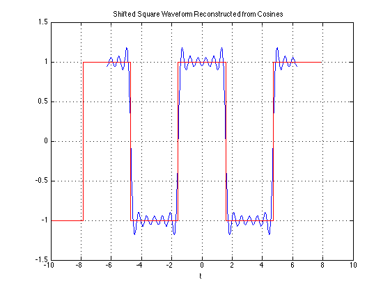

# Fourier Series (Part 1)

Dr Chris Jobling ([c.p.jobling@swansea.ac.uk](mailto:c.p.jobling@swansea.ac.uk))

Digital Technium 123

Office Hours: 12:00-13:00 Mondays

You can view the notes for this presentation in [HTML](http://cpjobling.github.io/EG-247-Resources/week5/fourier1.html
  ) and [PDF](http://cpjobling.github.io/EG-247-Resources/week5/fourier1.pdf).

  The source code of this presentation is available in Markdown format from GitHub: [fourier1.md](https://github.com/cpjobling/EG-247-Resources/tree/master/week5/fourier1.md).

The GitHub repository [EG-247 Resources](https://github.com/cpjobling/EG-247-Resources)
also contains the source code for all the Matlab/Simulink
examples and the Laboratory Exercises.


## Scope and Background Reading

This session launches our Introduction to Fourier Transforms with a look at Wave
Analysis and Trigonometric Fourier Series.

As we shall see, any periodic waveform can be approximated by a DC component
(which may be 0) and the sum of a fundamental and harmomic sinusoidal waveforms.
This has important applications in many applications of electronics but is
particularly important for signal processing and communications.

The material in this presentation and notes is based on Chapter 7 of [Steven T.
Karris, Signals and Systems: with Matlab Computation and Simulink Modelling, 5th
Edition.](http://site.ebrary.com/lib/swansea/docDetail.action?docID=10547416).

## Revision?

I believe that this subject may have been covered in EG-150 Signals and Systems.

Is that true?

## Agenda

* Motivating examples
* Wave analysis and the Trig. Fourier Series
* Symmetry in Trigonometric Fourier Series
* Computing coefficients of Trig. Fourier Series in Matlab
* Gibbs Phenomenon

# Motivating Examples

## Motivating Examples

This [Fourier Series
demo](http://users.ece.gatech.edu/mcclella/matlabGUIs#FourierSeries), developed
by Members of the [Center for Signal and Image Processing
(CSIP)](http://www.ece.gatech.edu/CSIP) at the [School of Electrical and
Computer Engineering](http://www.ece.gatech.edu/) at the [Georgia Institute of
Technology](http://www.gatech.edu/), shows how periodic signals can be
synthesised by a sum of sinusoidal signals.

It is here used as a motivational example in our introduction to [Fourier
Series](http://en.wikipedia.org/wiki/Fourier_series). (See also [Fourier
Series](http://mathworld.wolfram.com/FourierSeries.html) from Wolfram MathWorld
referenced in the **Quick Reference** on Blackboard.)

To install this example, download the [zip file](http://users.ece.gatech.edu/mcc
lella/matlabGUIs/ZipFiles/fseriesdemo-v130.zip) and unpack it somewhere on your
MATLAB path.

# Wave analysis and the Trig. Fourier Series

## Wave Analysis

* [Jean Baptiste Joseph Fourier](http://en.wikipedia.org/wiki/Joseph_Fourier)
(21 March 1768 – 16 May 1830) discovered that any *periodic signal* could be
represented as a series of *harmonically related* sinusoids.

* A *harmonic* is a frequency whose value is an integer multiple of some
*fundamental frequency*

* For example, the frequencies 2 MHz, 3 Mhz, 4 MHz are the second, third and
fourth harmonics of a sinusoid with fundamental frequency 1 Mhz.


## The Trigonometric Fourier Series

Any periodic waveform $f(t)$ can be represented as

$$\begin{gathered}
  f(t) = \frac{1}{2}{a_0} + {a_l}\cos \omega t + {a_2}\cos 2\omega t + {a_3}\cos
3\omega t +  \cdots  + {a_n}\cos n\omega t +  \cdots  \\
   + {b_l}\sin \omega t + {b_2}\sin 2\omega t + {b_3}\sin 3\omega t +  \cdots  +
{b_n}\sin n\omega t +  \cdots  \\
\end{gathered} $$

or equivalently (if more confusingly)

$$f(t) = \frac{1}{2}{a_0} + \sum\limits_{n = 1}^\infty  {({a_n}\cos n\omega t +
{b_n}\sin n\omega t)} $$

## Notation

* The first term $a_o/2$ is a constant and represents the DC (average) component
of the signal $f(t)$
* The terms with coefficients $a_1$ and $b_1$ together represent the fundamental
frequency component of $f(t)$ at frequency $\omega$.
* The terms with coefficients $a_2$ and $b_2$ together represent the second
harmonic frequency component of $f(t)$ at frequency $2\omega$.

And so on.

Since any periodic function $f(t)$ can be expressed as a Fourier series, it
follows that the sum of the DC, fundamental, second harmonic and so on must
produce the waveform $f(t)$.

## Sums of sinusoids

In general, the sum of two or more sinusoids does not produce a sinusoid as
shown below.


To generate this picture use
[fourier_series1.m](files/matlab/fourier_series1.m).

## Evaluation of the Fourier series coefficients

The coefficients are obtained from the following expressions (valid for any
periodic waveform with fundamental frequency $\omega_0$ so long as we integrate
over one period $0\to T_0$ where $T_0 = 2\pi/\omega_0$):

$$\frac{1}{2}a_0 = \frac{1}{2\pi}\int_{0}^{2\pi}f(t)dt$$

$$a_n = \frac{1}{\pi}\int_{0}^{2\pi}f(t)\cos nt\,dt$$

$$b_n = \frac{1}{\pi}\int_{0}^{2\pi}f(t)\sin nt\,dt$$

# Symmetry in Trigonometric Fourier Series

## Symmetry in Trigonometric Fourier Series

There are simplifications we can make if the original periodic properties has
certain properties:

* If $f(t)$ is odd, $a_0=0$ and there will be no cosine terms so ${a_n} = 0\;
\forall n > 0$
* If $f(t)$ is even, there will be no sine terms and ${b_n} = 0\; \forall n >
0$. The DC may or may not be zero.
* If $f(t)$ has *half-wave symmetry* only the odd harmonics will be present.
That is $a_n$ and $b_n$ is zero for all even values of $n$ (0, 2, 4, ...)


## Odd, Even and Half-wave Symmetry

**Recall**

* An *odd* function is one for which $f(t) = -f(-t)$. The function $\sin t$ is
an *odd* function.
* An *even* function is one for which $f(t) = f(-t)$. The function $\cos t$ is
an *even* function.

**Half-wave symmetry**

* A periodic function with period $T$ is a function for which $f(t) = f(t + T)$
* A periodic function with period $T$, has *half-wave symmetry* if $f(t) = -f(t + T/2)$

## Symmetry in Common Waveforms

To reproduce the following waveforms (without annotation) publish the script
[waves.m](files/matlab/waves.m).

## Squarewave


---

* Average value over period $T$ is ...?
* It is an **odd**/**even**function?
* It **has/has not** half-wave symmetry $f(t)=-f(t+T/2)$?

----

* Average value over period $T$ is zero.
* It is an *odd* function $f(t) = - f(-t)$
* It has half-wave symmetry $f(t)=-f(t+T/2)$

## Shifted Squarewave


----

* Average value over period $T$ is ...?
* It is an **odd**/**even** function?
* It **has/has not** half-wave symmetry $f(t)=-f(t+T/2)$?

----

* Average value over period $T$ is zero.
* It is an *even* function $f(t) = f(-t)$
* It has *half-wave symmetry* $f(t)=-f(t+T/2)$

## Sawtooth


----

* Average value over period $T$ is ...?
* It is an **odd**/**even** function?
* It **has/has not** half-wave symmetry $f(t)=-f(t+T/2)$?

----

* Average value over period $T$ is zero.
* It is an *odd* function $f(t) = - f(-t)$
* It doesn't have *half-wave symmetry* $f(t) \ne -f(t+T/2)$

## Triangle


----

* Average value over period $T$ is ...?
* It is an **odd**/**even**function?
* It **has/has not** half-wave symmetry $f(t)=-f(t+T/2)$?

----

* Average value over period $T$ is zero.
* It is an *odd* function $f(t) = - f(-t)$
* It has *half-wave symmetry* $f(t) = -f(t+T/2)$

## Symmetry in fundamental, second and third Harmonics

In the following, $T/2$ is taken to be the half-period of the fundamental
sinewave.

## Fundamental


----

* Average value over period $T$ is ...?
* It is an **odd**/**even**function?
* It **has/has not** half-wave symmetry $f(t)=-f(t+T/2)$?

----

* Average value over period $T$ is zero.
* It is an *odd* function $f(t) = - f(-t)$
* It has *half-wave symmetry* $f(t) = -f(t+T/2)$

## Second Harmonic


----


* Average value over period $T$ is ...?
* It is an **odd**/**even** function?
* It **has/has not** half-wave symmetry $f(t)=-f(t+T/2)$?

----

* Average value over period $T$ is zero.
* It is an *odd* function $f(t) = - f(-t)$
* It doesn't have *half-wave symmetry* $f(t) \ne -f(t+T/2)$

## Third Harmonic


----

* Average value over period $T$ is ...?
* It is an **odd**/**even** function?
* It **has/has not** half-wave symmetry $f(t)=-f(t+T/2)$?

----

* Average value over period $T$ is zero.
* It is an *odd* function $f(t) = - f(-t)$
* It has *half-wave symmetry* $f(t) = -f(t+T/2)$

## Some simplifications that result from symmetry

* The limits of the integrals used to compute the coefficents $a_n$ and $b_n$ of
the Fourier series are given as $0\to 2\pi$ which is one period $T$
* We could also choose to integrate from $-\pi \to \pi$
* If the function is *odd*, or *even* or has *half-wave symmetry* we can compute
$a_n$ and $b_n$ by integrating from $0\to \pi$ and multiplying by 2.
* If we have *half-wave symmetry* we can compute $a_n$ and $b_n$ by integrating
from $0\to \pi/2$ and multiplying by 4.

(For more details see page 7-10 of the textbook)

# Computing coefficients of Trig. Fourier Series in Matlab  
## Computing coefficients of Trig. Fourier Series in Matlab  

As an example let's take a square wave with amplitude $\pm A$ and period $T$.


## Solution

Solution: See [square_ftrig.m](files/matlab/square_ftrig.m). Script confirms
that:

* $a_0 = 0$
* $a_i = 0$: function is odd
* $b_i = 0$: for $i$ even - half-wave symmetry

```
ft =

(4*A*sin(t))/pi + (4*A*sin(3*t))/(3*pi) + ..
(4*A*sin(5*t))/(5*pi) + (4*A*sin(7*t))/(7*pi) + ..
(4*A*sin(9*t))/(9*pi) + (4*A*sin(11*t))/(11*pi)
```
----


<div class="notes">
Note that the coefficients match those given in the textbook (Section 7.4.1).

$$f(t) = \frac{4A}{\pi}\left(\sin \omega t + \frac{1}{3}\sin 3\omega t +
\frac{1}{5}\sin 5\omega t + \cdots\right) =
\frac{4A}{\pi}\sum_{n=\mathrm{odd}}\frac{1}{n}\sin n\omega t$$
</div>

## Using symmetry - computing the Fourier series coefficients of the shifted square wave


----

* As before $a_0=0$
* We observe that this function is even, so all $b_k$ coefficients will be zero
* The waveform has half-wave symmetry, so only odd indexed coefficients will be
present.
* Further more, because it has half-wave symmetry we can just integrate from $0
\to \pi/2$ and multiply the result by 4.

See [shifted_sq_ftrig.m](matlab/shifted_sq_ftrig.m).

----

```
ft =

(4*A*cos(t))/pi - (4*A*cos(3*t))/(3*pi) + ..
(4*A*cos(5*t))/(5*pi) - (4*A*cos(7*t))/(7*pi) + ..
(4*A*cos(9*t))/(9*pi) - (4*A*cos(11*t))/(11*pi)
```

----



<div class="notes">
Note that the coefficients match those given in the textbook (Section 7.4.2).

$$f(t) = \frac{4A}{\pi}\left(\cos \omega t - \frac{1}{3}\cos 3\omega t +
\frac{1}{5}\cos 5\omega t - \cdots\right) =
\frac{4A}{\pi}\sum_{n=\mathrm{odd}}(-1)^{\frac{n-1}{2}} \frac{1}{n}\cos n\omega
t$$
</div>

## More Examples

We will compute other examples from the text-book in the Lab.

# Gibbs Phenomenon

## Gibbs Phenomenon

In an earlier slide we found that the trigonometric for of the Fourier series of
the square waveform is

$$f(t) = \frac{4A}{\pi}\left(\sin \omega t + \frac{1}{3}\sin 3\omega t +
\frac{1}{5}\sin 5\omega t + \cdots\right) =
\frac{4A}{\pi}\sum_{n=\mathrm{odd}}\frac{1}{n}\sin n\omega t$$

----

The next slide shows the approximation for the first 11 harmonics:


----

As we add more harmonics, the sum looks more and more like a square wave.
However the crests do not become flattened; this is known as *Gibbs Phenomenon*
and it occurs because of the discontinuity of the perfect sqare waveform as it
changes from $+A$ to $-A$ and *vice versa*.

## End of Part 1

This concludes our introduction to Fourier series.

*Next Time*

* The exponential Fourier series
* Line spectra
* Power in periodic signals

## Lab Work

In the lab in week 7 we will compute some Trigonometric Fourier series
