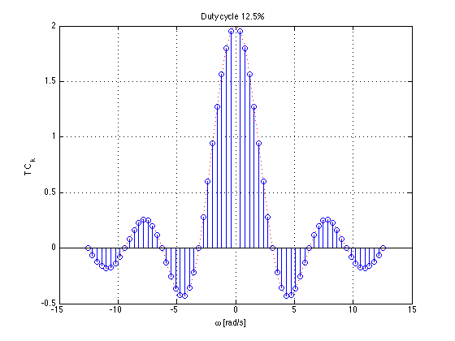

# The Fourier Transform (Part 1)

Dr Chris Jobling ([c.p.jobling@swansea.ac.uk](mailto:c.p.jobling@swansea.ac.uk))

Digital Technium 123

Office Hours: 12:00-13:00 Mondays

You can view the notes for this presentation in [HTML](http://cpjobling.github.io/EG-247-Resources/week7/ft1.html
  ) and [PDF](http://cpjobling.github.io/EG-247-Resources/week7/ft1.pdf).

  The source code of this presentation is available in Markdown format from GitHub: [ft1.md](https://github.com/cpjobling/EG-247-Resources/tree/master/week7/ft1.md).

The GitHub repository [EG-247 Resources](https://github.com/cpjobling/EG-247-Resources)
also contains the source code for all the Matlab/Simulink
examples and the Laboratory Exercises.

## Scope and Background Reading

This session continues our coverage of **Fourier Analysis** with an introduction
to the **Fourier Transform**.

* **Fourier Series** is used when we are dealing with signals that are
*periodic* in time. It is based on harmonics of the fundamental frequency
$\omega_0$ of the periodic signal where the period $T = 2\pi/\omega_0$.

* The line spectrum occur at integer multiples of the fundamental frequency
$k\omega_0$ and is a *discrete* (or sampled) function of frequency.

* As the period $T$ is increased, the distance between harmonics decreases
because $\omega_0$ reduces.

* In the limit $T\to \infty$, the signal becomes **aperiodic** and $k\omega_0
\to \omega$ which is a *continuous* function of frequency.

----

This is the basis of the **Fourier Transform** which is very important as the
basis for data transmission, signal filtering, and the determination of system
frequency response.

----

The material in this presentation and notes is based on Chapter 8 (Starting at
Section 8.1) of [Steven T. Karris, Signals and Systems: with Matlab Computation
and Simulink Modelling, 5th
Edition.](http://site.ebrary.com/lib/swansea/docDetail.action?docID=10547416)
from the **Required Reading List**. I also used Chapter 5 of [Benoit Boulet,
Fundamentals of Signals and
Systems](http://site.ebrary.com/lib/swansea/docDetail.action?docID=10228195)
from the **Recommended Reading List**.

## Agenda

* Fourier Transform as the Limit of a Fourier Series
* Doing the Maths
* The Fourier Transform
* Properties of the Fourier Transform
* Some Examples
* Computing Fourier Transforms in Matlab

#  Fourier Transform as the Limit of a Fourier Series

##  Fourier Transform as the Limit of a Fourier Series

We start by considering the pulse train that we used in the last lecture and
demonstrate that the discrete line spectra for the Fourier Series becomes a
continuous spectrum as the signal becomes aperiodic.

This analysis is from Boulet pp 142&mdash;144 and 176&mdash;180.

----

Let $\tilde x(t)$ be the Fourier series of the rectangular pulse train shown
below:

## Fourier Series

In the previous lecture we used

$$C_k = \frac{1}{2\pi}\int_{-\pi/w}^{\pi/w} Ae^{-jk(\omega t)}\,d(\omega t) =
\frac{A}{2\pi}\int_{-\pi/w}^{\pi/w} e^{-jk(\omega t)}\,d(\omega t) $$

to compute the line spectra.

## From the Time Point of View

If we instead take a time point-of-view and let $A = 1$

$$C_k = \frac{1}{T}\int_{-t_0}^{t_0} e^{-jk\omega_0 t}\,dt.$$

We'll complete the analysis on the board.

$$C_k = \frac{1}{T}\int_{-t_0}^{t_0} e^{-jk\omega_0 t}\,dt =
-\frac{1}{jk\omega_0 T}\left[e^{-jk\omega_0 t}\right]_{-t_0}^{t_0} =
-\frac{1}{jk\omega_0 T}\left(e^{-jk\omega_0 t_0}-e^{jk\omega_0 t_0}\right)$$

$$C_k = \frac{2}{k\omega_0 T}\left(\frac{e^{jk\omega_0 t_0}-e^{-jk\omega_0
t_0}}{2j}\right) = 2\frac{\sin(k\omega_0 t_0)}{k\omega_0 T}$$

and since $\omega_0 = 2\pi/T$

$$C_k = \frac{\sin\left(\pi k\frac{2t_0}{T}\right)}{k\pi } =
\frac{T}{2t_0}{\mathop{\rm sinc}}\left(\pi k\frac{2t_0}{T}\right)$$

## Solution

$$C_k = \frac{T}{2t_0}{\mathop{\rm sinc}}\left(\pi k\frac{2t_0}{T}\right)$$

## The Sinc Function

The function, $\sin(x)/x$ crops up again and again in Fourier analysis. The
Fourier coefficients $C_k$ are scaled *samples* of the real continuous
*normalized sinc* function defined as follows:

$$\operatorname{sinc} u: = \frac{{\sin \pi u}}{{\pi u}},\;u \in \mathbb{R}.$$

The function is equal to 1 at $u=0$* and has zero crossings at $u=\pm
n,\; n=1,2,3,\ldots$ as shown on the next slide.

----

Matlab code to reproduce this plot: [sinc_plot.m](matlab/sinc_plot.m).

$^*$Note $sin(\pi u)/(\pi u)$ is undefined at $u = 0$. To compute its value we need
to take the limit

$$\lim_{u\to 0} \frac{\sin(\pi u)}{u}$$

which can be shown to be 1. I leave the discovery of the proof to you and the
internet.

## Duty cycle

* We define the duty cycle $\eta = 2t_0/T$ of the rectangular pulse train as the
fraction of the time the signal is "on" (equal to 1) over one period.
* The duty cycle is often given as a percentage.

----

The spectral coefficients expressed using the normalized sinc function and the
duty cycle can be written as

$$C_k = \frac{2t_0}{T}\frac{\sin\left(\frac{\pi k2t_0}{T}\right)}{\frac{\pi
k2t_0}{T}}=\frac{2t_0}{T}\operatorname{sinc}\left(\frac{k2t_0}{T}\right)$$

$$C_k = \eta \operatorname{sinc}\left(k\eta\right)$$

## Normalize the spectral coefficients

Let us normalize the spectral coefficients of $\tilde x(t)$ by mutiplying them
by $T$, and assume $t_0$ is fixed so that the duty cycle $\eta = 2t_0/T$ will
decrease as we increase $T$:

$$T C_k = T\eta \operatorname{sinc}\left(k\eta\right)=2t_0\operatorname{sinc}\left(k\frac{2t_0}{T}\right)$$

Then the normalized coefficients $T C_k$ of the rectangular wave a is a sinc envelope
with constant amplitude at the origin equal to $2t_0$, and a zero crossing at
fixed frequency $\pi/t_0$ rad/s, both independent of T.

Plots follow (use [duty_cycle.m](files/matlab/duty_cycle.m) to reproduce).

## Duty cycle 50%

## Duty cycle 12.5%

## Comments

* As the fundamental period increases, we get more spectral lines packed into
the lobes of the sinc envelope.
* These normalized spectral coefficients turn out to be samples of the
continuous sinc function on the spectrum of $\tilde{x}(t)$
* The two spectra are plotted against the frequency variable $k\omega_0$ with
units of rad/s rather than index of harmonic component
* The first zeros of each side of the main lobe are at frequencies $\omega = \pm
\pi/t_0$ rad/s
* The zero-crossing points of sinc envelope are independent of the period T.
They only depend on $t_0$.

## Intuition leading to the Fourier Transform

* An aperiodic signal that has been made periodic by "repeating" its graph every
$T$ seconds will have a line spectrum that becomes more and more dense as the
fundamental period is made longer and longer.
* The line spectrum has the same continuous envelope.
* As $T$ goes to infinity, the line spectrum will become a continuous function
of $\omega$.
* The *envelope* is this function.

# Doing the Maths

## Doing the Maths

Fourier series coefficients for the rectangular wave are computed using:

$$C_k = \frac{1}{T}\int_{-t_0}^{t_0} \tilde{x}(t) e^{-jk(\omega_0 t)}\,dt $$

where $\omega_0 = 2\pi/T$ as usual.

Now define a signal $x(t)$ as a signal equal to $\tilde{x}(t)$ over one period
and zero elsewhere.

----

## A rectangular pulse

The aperiodic signal, a single rectangular pulse, can be thought of as being
periodic with an infinite fundamental period (we will let $T\to +\infty$ later).

Since $\tilde{x}(t)=x(t)$ over $t \in [-T/2,T/2]$, the spectral coefficients
$C_k$ of the periodic signal $\tilde{x}(t)$ can be written in terms of the
aperiodic signal $x(t)$ as follows:

$$C_k = \frac{1}{T}\int_{-\infty}^{+\infty}x(t)e^{-jk\omega_0 t} dt.$$

----

Let us define the envelope $X(j\omega)$ of $T C_k$ (we already know this to be
the sinc function):

$$X(j\omega):= \int_{-\infty}^{+\infty}x(t)e^{-j\omega t} dt =
\int_{-t_0}^{+t_0}e^{-j\omega t} dt =
2t_0\operatorname{sinc}\left(\frac{t_0}{\pi}\omega\right).$$

The coefficients $C_k$ are therefore samples of the continuous envelope
$X(j\omega)$:

$$C_k = \frac{1}{T}X(jk\omega_0).$$

## Back to the periodic signal

$\tilde{x}(t)$ has the Fourier series representation

$$\tilde{x}(t) = \sum_{k=-\infty}^{\infty}\frac{1}{T}X(jk\omega_0)e^{jk\omega_0
t}.$$

or equivalently, since $\omega_0 = 2\pi/T$:

$$\tilde{x}(t) = \frac{1}{2\pi}
\sum_{k=-\infty}^{\infty}X(jk\omega_0)e^{jk\omega_0 t}\omega_0.$$

## Now take the limits

At the limit, as $T\to \infty$, in

$$\tilde{x}(t) = \frac{1}{2\pi} \sum_{k=-\infty}^{\infty}
X(jk\omega_0)e^{jk\omega_0 t}\omega_0.$$

we get

* $\omega_0 \to d\omega$ &ndash; the fundamental frequency becomes
infinitesimally small.
* $k\omega_0 \to \omega$ &ndash; harmonic frequencies get so close together they
become a continuum.
* The summation becomes an integral.
* $\tilde{x}(t) \to x(t)$ &ndash; the periodic signal tends to the aperiodic
signal.

# The Fourier Transform

## Define the Inverse Fourier and Fourier Transform

Putting these elements together we have an expression for the aperiodic signal
in terms of its Fourier transform:

**Inverse Fourier Transform**:

$$x(t) = \frac{1}{2\pi} \int_{-\infty}^{\infty} X(j\omega)e^{j\omega t}\,d\omega
:= \mathcal{F}^{-1} \left\{X(j\omega)\right\}$$

Similarly, given the expression we have already seen for an arbitrary $x(t)$:

**Fourier Transform**:

$$X(j\omega) = \int_{-\infty}^{\infty}x(t)e^{-j\omega t}\,dt :=
\mathcal{F}\left\{x(t)\right\}.$$

## Fourier Transform Pair

* The two equations on the previous slide are called the *Fourier transform
pair*.
* They are analogous to the *Laplace transform pair* we have already seen and we
can develop tables of properties and transform pairs in the same way.
* Equation $X(j\omega) = \int_{-\infty}^{\infty}x(t)e^{-j\omega t}\,dt.$ gives
the *Fourier transform* or the *frequency spectrum* of the signal $x(t)$.
* Equation $x(t) = \frac{1}{2\pi} \int_{-\infty}^{\infty} X(j\omega)e^{j\omega
t}\,d\omega.$ is the *inverse Fourier transform*. It gives the function of time
that has a given spectrum in the frequency domain.

# Properties of the Fourier Transform

## Properties of the Fourier Transform

Again, we will provide any properties that you might need in the examination.

For fun, you may like to read and even complete the proofs for these properties
guided by the text books Karris (Section 8.3) or Boulet pp 180&mdash;185.

We are more interested in your ability to exploit the properties in problem
solving.

A little more detail is given in the notes available on Blackboard.

## Table of Properties of the Fourier Transform

As was the case of the Laplace Transform, properties of Fourier transforms are
usually summarized in Tables of Fourier Transform properties. For example this
one: [Properties of the Fourier Transform (Wikpedia)](http://en.wikipedia.org/wiki/Fourier_transform#Properties_of_the_Fourier_transform) and Table 8.8 in
Karris (page 8-17).

Some of the more important properties are summarized with some commentary in the notes.

| No. | **Name** | $f(t)$ | $F(j\omega)$ | **Remarks** |
|----:|----------|--------|--------------|-------------|
| 1.   | Linearity | $a_1f_1(t)+a_2f_2(t)+\cdots+a_nf_n(t)$ | $a_1F_1(j\omega)+a_2F_2(j\omega)+\cdots+a_nF_n(j\omega)$ | Fourier transform is a linear operator. |
| 2.   | Symmetry | $2\pi f(-j\omega)$ | $F(t)$ | |
| 3.  | Time and frequency scaling | $f(\alpha t)$ | $$\frac{1}{|\alpha|}F\left(j\frac{\omega}{\alpha}\right)$$ | time compression is frequency expansion and *vice versa* |
| 4.  | Time shifting | $$f(t-t_0)$$ | $$e^{-j\omega t_0}F(j\omega)$$ | A time shift corresponds to a phase shift in frequency domain |
| 5.  | Frequency shifting | $$e^{j\omega_0 t}f(t)$$ | $$F(j\omega-j\omega_0)$$ | Multiplying a signal by a complex exponential results in a frequency shift. |
| 6.  | Time differentiation | $$\frac{d^n}{dt^n}\,f(t)$$ | $$(j\omega)^nF(j\omega)$$ | |
| 7.  | Frequency differentiation | $$(-jt)^n f(t)$$ | $$\frac{d^n}{d\omega^n}F(j\omega)$$ | |
| 8.  | Time integration | $$\int_{-\infty}^{t}f(\tau)d\tau$$ | $$\frac{F(j\omega)}{j\omega}+\pi F(0)\delta(\omega)$$ | |
| 9.  | Conjugation | $$f^*(t)$$ | $$F^*(-j\omega)$$ | |
| 10. | Time convolution | $$f_1(t)*f_2(t)$$ | $$F_1(j\omega) F_2(j\omega)$$ | Compare with Laplace Transform | |
| 11. | Frequency convolution | $$f_1(t)f_2(t)$$ | $$\frac{1}{2\pi}F_1(j\omega)*F_2(j\omega)$$ | This has application to amplitude modulation as shown in Boulet pp 182&mdash;183. |
| 12. | Area under $f(t)$ | $$\int_{-\infty}^{\infty} f(t)\,dt = F(0)$$ | | Way to calculate DC (or average) value of a signal |
| 13. | Area under $F(j\omega)$ | $$f(0) = \frac{1}{2\pi}\int_{-\infty}^{\infty}F(j\omega)\,d\omega$$ |  |
| 14. | Energy-Density Spectrum | $$E_{[\omega_1,\omega_2]}:=\frac{1}{2\pi}\int_{\omega_1}^{\omega_2}|F(j\omega)|^2\,d\omega.$$ | |
| 15. | Parseval's theorem | $$\int_{-\infty}^{\infty}|f(t)|^2\,dt=\frac{1}{2\pi}\int_{-\infty}^{\infty}|F(j\omega)|^2\,d\omega.$$ | | Definition RMS follows from this |

See also: [Wikibooks: Engineering Tables/Fourier Transform Properties](http://en.wikibooks.org/wiki/Engineering_Tables/Fourier_Transform_Properties) and
[Fourier Transfom&mdash;WolframMathworld](http://mathworld.wolfram.com/FourierTransform.html) for more complete references.

### Linearity

The Fourier transform is a linear operation:

$$a_1f_1(t)+a_2f_2(t)+\cdots+a_nf_n(t)\Leftrightarrow
a_1F_1(j\omega)+a_2F_2(j\omega)+\cdots+a_nF_n(j\omega)$$

### Symmetry

If $F(j\omega)$ is the Fourier transform of $f(t)$, the *symmetry property of
the Fourier transform* states that

$$F(t)\Leftrightarrow2\pi f(-j\omega)$$

That is if in $F(j\omega)$ we replace $j\omega$ with $t$, we obtain this pair.

### Time/Frequency Scaling

Scaling the time variable with $\alpha  \in \mathbb{R}$ either expands or
compresses the Fourier transform:

$$f(\alpha t)\Leftrightarrow \frac{1}{|\alpha|}F\left(j\frac{\omega}{\alpha}\right)$$

* For $\alpha > 0$, the signal $f(\alpha t)$ is sped up (or compressed in time),
so its frequency components will be expanded to higher frequencies.
* For $\alpha < 0$, the signal $f(\alpha t)$ is slowed down (or expanded in
time), so its frequency components will be compressed to lower frequencies.

### Time Shifting

A time shift results in a phase shift in the Fourier transform

$$f(t-t_0) \Leftrightarrow e^{-j\omega_0}F(j\omega)$$

where $\omega_0 = 2\pi/t_0$

### Frequency Shifting

Multiplying a time function by a complex exponential results in a frequency shift

$$e^{j\omega 0}f(t) \Leftrightarrow X(j\omega-j\omega_0)$$

### Time Differentiation

If $F(j\omega)$ is the Fourier transform of $f(t)$

$$\frac{d^n}{dt^n}\,f(t)\Leftrightarrow (j\omega)^nF(j\omega)$$

### Frequency Differentiation

If $F(j\omega)$ is the Fourier transform of $f(t)$

$$(-jt)^n f(t)\Leftrightarrow \frac{d^n}{d\omega^n}F(j\omega)$$

### Time Integration

If $F(j\omega)$ is the Fourier transform of $f(t)$

$$\int_{-\infty}^{t}f(\tau)d\tau \Leftrightarrow \frac{F(j\omega)}{j\omega}+\pi
F(0)\delta(\omega)$$

### Conjugate Time and Frequency Functions

If $F(j\omega)$ is the Fourier transform of the complex function $f(t)$

$$f^*(t)\Leftrightarrow F^*(-j\omega)$$

### Time Convolution

$$f_1(t)*f_2(t) \Leftrightarrow F_1(j\omega) F_2(j\omega)$$

That is convolution in the time domain corresponds to multiplication in the
frequency domain.

(Compare with Laplace Transform)

### Frequency Convolution

$$f_1(t)f_2(t) \Leftrightarrow \frac{1}{2\pi} F_1(j\omega)*F_2(j\omega)$$

That is, multiplication in the time domain corresponds to convolution in the
frequency domain.

This also has application to amplitude modulation as shown in Boulet pp
182&mdash;183.

### Area under f(t)

$$\int_{-\infty}^{\infty} f(t)\,dt = F(0)$$

That is, the area under a time function $f(t)$ is equal to the value of the
Fourier transform of $f(t)$ evaluated at $\omega = 0$ rad/s.

### Area under F(jomega)

$$f(0) = \frac{1}{2\pi}\int_{-\infty}^{\infty} F(j\omega)\,d\omega$$

That is, the value of a time function, $f(t)$, evaluated at $t=0$ is equal to
the area under its Fourier transform $F(j\omega)$ times $1/2\pi$.

### Energy-Density Spectrum

Recalling that the power spectrum of a periodic signal is defined as the squared
magnitudes of its Fourier series coefficients. A plot of the power spectrum of a
signal gives us an idea of the power at different frequencies (harmonics).

By analogy, the *energy-density spectrum* of an aperiodic signal is defined as
the magnitude squared of its spectrum; that is $|F(j\omega)|^2$ is the energy-
density spectrum of $f(t)$.

For example

$$E_{[\omega_1,\omega_2]}:=\frac{1}{2\pi}\int_{\omega_1}^{\omega_2}|F(j\omega)|^
2\,d\omega.$$

Note that for real signals, it is customary to include the negative frequency
band as well.

### Parseval's Theorem

Just like the total average power of a periodic signal is equal to the sume of
the powers of all the harmonics, the total energy in an aperiodic signal is equal
to the total energy in its spectrum.

This is the Parseval equality for Fourier transforms:

$$\int_{-\infty}^{\infty}|f(t)|^2\,dt=\frac{1}{2\pi}\int_{-\infty}^{\infty}|F(j\
omega)|^2\,d\omega.$$

# Some Examples

## Some Examples

1. Amplitude Modulation
2. Impulse response
3. Energy computation

## Example 1: Amplitude Modulation

Compute the result of multiplying a signal $f(t)$ by a carrier waveform $\cos\omega_c t$.

*Hint* use Euler's identity and the frequency shift property.

### Solution 1

$$\cos\omega_c t = \frac{e^{j\omega_c t}+e^{-j\omega_c t}}{2}$$

it follows from the *frequency shifting* property that

$$f(t)\cos\omega_c t \Leftrightarrow \frac{F(j\omega-j\omega_c)+F(j\omega +
j\omega_c)}{2}.$$

Similarly

$$f(t)\sin\omega_c t \Leftrightarrow \frac{F(j\omega-j\omega_c)-F(j\omega +
j\omega_c)}{j2}.$$

#### Remarks

We can also tackle this using the Frequency Convolution property. See Boulet pp 182&mdash;183.

## Example 2: Impulse response

A system has impulse response $f(t) = e^{-t}u_0(t)$. Compute the frequency
spectrum of this system.

### Solution 2

$$\begin{gathered}
  \mathcal{F}\left\{ {{e^{ - t}}{u_0}(t)} \right\} = \int_0^\infty  {{e^{ - t}}} {e^{ - j\omega t}}\;{\kern 1pt} dt \\
   = \int_0^\infty  {{e^{ - (1 + j\omega )t}}} \;{\kern 1pt} dt \\
   =  - \frac{1}{{j\omega  + 1}}\left[ {{e^{ - (1 + j\omega )t}}} \right]_0^\infty  \\
   =  - \frac{1}{{j\omega  + 1}}\left[ {0 - 1} \right] \\
  F(j\omega ) = \frac{1}{{j\omega  + 1}} \\
\end{gathered} $$

Thus

$$e^{ - t}{u_0}(t)\Leftrightarrow \frac{1}{{j\omega  + 1}}$$

## Example 3: Energy computation

An aperiodic real signal $f(t)$ has Fourier transform $F(j\omega)$. Compute the
energy contained in the signal between 5kHz and 10kHz.

### Solution 3

Use the Energy-Density function.

$$E_{[10,000\pi,20,000\pi]}^r=\frac{1}{2\pi}\left[\int_{10,000\pi}^{20,000\pi}|X
(j\omega)|^2\,d\omega +
\frac{1}{2\pi}\int_{-20,000\pi}^{-10,000\pi}|X(j\omega)|^2\,d\omega\right] =
\frac{1}{\pi}\int_{10,000\pi}^{20,000\pi}|X(j\omega)|^2\,d\omega.$$

# Computing Fourier Transforms in Matlab

## Computing Fourier Transforms in Matlab

MATLAB has the built-in `fourier` and `ifourier` functions that can be used
to compute the Fourier transform and its inverse. We will explore some of these
in the lab.

For now, here's an example:

## Example

Use Matlab to confirm the Fourier transform pair:

$$e^{-\frac{1}{2}t^2}\Leftrightarrow \sqrt{2\pi}e^{-\frac{1}{2}\omega^2}$$

See script: [ftex1.m](matlab/ftex1.m).

## End of Part 1

*Summary*

* Fourier Transform as the Limit of a Fourier Series
* Doing the Maths
* The Fourier Transform
* Properties of the Fourier Transform
* Some Examples
* Computing Fourier Transforms in Matlab

*Next Time*

* [Fourier transform of commonly occuring signals](http://cpjobling.github.io/EG-247-Resources/week7/ft2.html)
([Slides](http://cpjobling.github.io/EG-247-Resources/week7/ft2.slides.pdf))
