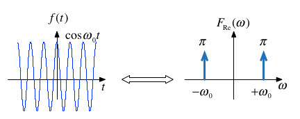
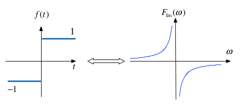
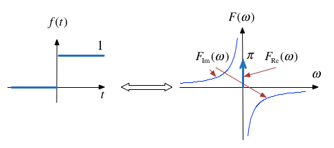

# The Fourier Transform (Part 2)

Dr Chris Jobling ([c.p.jobling@swansea.ac.uk](mailto:c.p.jobling@swansea.ac.uk))

Digital Technium 123

Office Hours: 12:00-13:00 Mondays

You can view the notes for this presentation in [HTML](http://cpjobling.github.io/EG-247-Resources/week7/ft2.html
  ) and [PDF](http://cpjobling.github.io/EG-247-Resources/week7/ft2.pdf).

  The source code of this presentation is available in Markdown format from GitHub: [ft1.md](https://github.com/cpjobling/EG-247-Resources/tree/master/week7/ft2.md).

The GitHub repository [EG-247 Resources](https://github.com/cpjobling/EG-247-Resources)
also contains the source code for all the Matlab/Simulink
examples and the Laboratory Exercises.

<div class="notes">
### Note on Notation

If you have been reading both Karris and Boulet you may have noticed a
difference in the notation used in the definition of Fourier Transform:

* Karris uses $F(\omega)$
* Boulet uses $F(j\omega)$

I checked other sources and [Hsu (Schaum's Signals and
Systems)](https://www.dawsonera.com/abstract/9780071634731) and Morrell (The
[Fourier Analysis Video Series on YouTube](http://www.youtube.com/watch?v=bqYxhY
GA2qU&list=PL51707156C4956932&feature=share&index=10)) both use the $F(\omega)$
notation.

According to Wikipedia [Fourier Transform: Other
Notations](http://en.wikipedia.org/wiki/Fourier_transform#Other_notations) both
are used only by electronic engineers anyway and either would be acceptible.

There is some advantage in using Boulet's notation $F(j\omega)$ in that it helps
to reinforce the idea that Fourier Transform is a special case of the Laplace
Transform and it was the notation that I used in the last session.

In these notes, I've used the other convention on the basis that its the more
likely to be seen in your support materials.

However, I am happy to change back if you find the addition of $j$ useful.

You should be aware that Fourier Transforms are in general complex so whatever
the notation used to *represent* the transform, we are still dealing with real
and imaginary parts or magnitudes and phases when we use the *actual transforms*
in analysis.

</div>


## Scope and Background Reading

This session continues our introduction to the Fourier Transform with several
examples extracted from tables of transform tables.

The material in this presentation and notes is based on Chapter 8 (Starting at
Section 8.4) of [Steven T. Karris, Signals and Systems: with Matlab Computation
and Simulink Modelling, 5th
Edition.](http://site.ebrary.com/lib/swansea/docDetail.action?docID=10547416)
from the Required Reading List. I also used Chapter 5 of [Benoit Boulet,
Fundamentals of Signals and
Systems](http://site.ebrary.com/lib/swansea/docDetail.action?docID=10228195)
from the Recommended Reading List.


## Agenda

*Last time*

* Fourier Transform as the Limit of a Fourier Series
* Doing the Maths
* The Fourier Transform
* Properties of the Fourier Transform
* Some Examples
* Computing Fourier Transforms in Matlab

*This Time*

* Tables of Transform Pairs
* Examples of Selected Transforms
* Relationship between Laplace and Fourier
* Fourier Transforms of Common Signals


# Reminder of the Definitions

Last time we derived the Fourier Transform by evaluating what would happen when
a periodic signal was made periodic. Let us restate the definitions.

## The Fourier Transform

In the signals and systems context, the Fourier Transform is used to convert a
function of time $f(t)$ to a function of radian frequency $F(\omega)$:

$$\mathcal{F}\left\{f(t)\right\} = \int_{-\infty}^{\infty} f(e)e^{-j\omega
t}\,dt = F(\omega).$$

## The Inverse Fourier Transform

In the signals and systems context, the *Inverse Fourier Transform* is used to
convert a function of frequency $F(\omega)$ to a function of time $f(t)$:

$$\mathcal{F}^{-1}\left\{F(\omega)\right\} =
\frac{1}{2\pi}\int_{-\infty}^{\infty} F(\omega)e^{j\omega t}\,d\omega = f(t) .$$

Note, the factor $2\pi$ is introduced because we are changing units from
radians/second to seconds.

## Duality of the transform

Note the similarity of the Fourier and its Inverse. This has important
consequences in filter design and later when we consider sampled data systems.

## Table of Common Fourier Transform Pairs

[This table](http://cpjobling.github.io/EG-247-Resources/week7/ft_table.html) is adapted from Table 8.9 of Karris. See also: [Wikibooks:
Engineering Tables/Fourier Transform
Table](http://en.wikibooks.org/wiki/Engineering_Tables/Fourier_Transform_Table)
and [Fourier Transfom&mdash;WolframMathworld](http://mathworld.wolfram.com/FourierTransform.html) for more complete references.

# Examples of Selected Transforms

<div class="notes">

### Relationship between f(t) and F(omega)

In most of the work we will do in this course, and in practice, the *signals*
that we use with the Fourier transform will be a real continuous aperiodic
functions of time that are zero when $t = 0$.

The Fourier transforms of such a signals will be complex continuous function of
frequency which have real and imaginary parts and will exist at both positive
and negative values of $\omega$.

It is often most convenient to deal with the transformed "spectrum" by
considering the magnitude and phase and we will therefore often plot $F(\omega)$
on two separate graphs as *magnitude* $|F(\omega)|$ and *phase* $\angle
F(\omega)$ (where phase is measured in radians) plotted against frequency
$\omega \in [-\infty,\infty]$ (in radians/second).

We most often represent the *system* by its so-called *frequency response* and
we will be interested in what effect the system has on the signal $f(t)$.

As for the Laplace transform, this is more conveniently determined by exploiting
the *time convolution property*. That is by performing a Fourier transform of
the signal, multiplying it by the system's frequency response and then inverse
Fourier transforming the result.

Have these ideas in mind as we go through the examples in the rest of this
session.
</div>

## The Dirac Delta

$$\delta(t) \Leftrightarrow 1$$


<div class="notes">
*Proof*: uses sampling and sifting properties of $\delta(t)$.


*Matlab*:

```matlab
syms t;
fourier(dirac(t))
```

Related:

$$\delta(t-t_0) \Leftrightarrow e^{-j\omega t_0}$$
</div>

## DC

$$1 \Leftrightarrow 2\pi\delta(\omega)$$


<div class="notes">
*Matlab*:

```matlab
syms A t;
fourier(1)
```

Related by frequency shifting property:

$$e^{j\omega_0 t} \Leftrightarrow 2\pi\delta(\omega-\omega_0)$$
</div>

## Cosine wave (Sinewave with even symmetry)

$$\cos(t) = \frac{1}{2}\left(e^{j\omega_0 t}+e^{-j\omega_0 t}\right)
\Leftrightarrow \pi\delta(\omega - \omega_0) + \pi\delta(\omega + \omega_0)$$



<div class="notes">
Note: $f(t)$ is real and even. $F(\omega)$ is also real and even.
</div>

## Sine wave

$$\sin(t) = \frac{1}{j2}\left(e^{j\omega_0 t}-e^{-j\omega_0 t}\right)
\Leftrightarrow j\pi\delta(\omega - \omega_0) - j\pi\delta(\omega + \omega_0)$$


<div class="notes">
Note: $f(t)$ is real and odd. $F(\omega)$ is imaginary and odd.
</div>

## Signum (Sign)

The signum function is a function whose value is equal to

$$\operatorname{sgn} x = \left\{ {\begin{array}{*{20}{c}}
  { - 1\;x < 1} \\
  {0\;x = 0} \\
  { + 1\;x > 0}
\end{array}} \right.$$

This function is often used to model a *voltage comparitor* in circuits.

---

The transform is:

$$\operatorname{sgn} x = u_0(t) - u_0(-t) = \frac{2}{j\omega}$$




## Example 1: Unit Step

Use the signum function to show that
$$\mathcal{F}\left\{u_0(t))\right\} = \pi\delta(\omega)+\frac{1}{j\omega}$$

## Clue

Define

$$u_0(t) = 2\operatorname{sgn} x - 1$$

*Does that help?*

----


<div class="notes">
### Proof

$$\operatorname{sgn} x = 2u_0(t) - 1$$

so

$$u_0(t) = \frac{1}{2}\left[1 + \operatorname{sgn} x\right]$$

From previous results $1\Leftrightarrow 2\pi\delta(\omega)$ and
$\operatorname{sgn} x = 2/(j\omega)$ so by linearity

$$u_0(t) \Leftrightarrow \pi\delta(\omega)+\frac{1}{j\omega}$$

*QED*

</div>

## Graph of unit step

$$u_0(t) \Leftrightarrow \pi\delta(\omega)+\frac{1}{j\omega}$$



<div class="notes">
Unit step is neither even nor odd so the Fourier transform is complex with real
part $F_\mathrm{Re}(\omega) = \pi\delta(\omega)$ and imaginary part
$F_\mathrm{Im}(\omega) = 1/(j\omega)$. The real part is even, and the imaginary
part is odd.
</div>

## Example 2

Use the results derived so far to show that

$$e^{j\omega_0 t}u_0(t)\Leftrightarrow \pi\delta(\omega - \omega_0) +
\frac{1}{j(\omega-\omega_0)}$$

Hint: linearity plus frequency shift property.

## Example 3

Use the results derived so far to show that

$$\sin \omega_0 t\; u_0(t)\Leftrightarrow
\frac{\pi}{j2}\left[\delta(\omega-\omega_0)-\delta(\omega+\omega_0)\right] +
\frac{\omega_0}{\omega_0^2 - \omega^2}$$

Hint: Euler's formula plus solution to example 2.

<div class="notes">
**Important note**: the equivalent example in Karris (Section 8.4.9 Eq. 8.75 pp
8-23&mdash;8-24) is wrong!

See worked solution on Blackboard for the corrected proof.
</div>

## Example 4

Use the result of Example 3 to determine the Fourier transform of $\cos\omega_0
t\; u_0(t)$.

<div class="notes">
### Answer

$$\cos\omega_0 t\; u_0(t)\Leftrightarrow
\frac{\pi}{2}\left[\delta(\omega-\omega_0)+\delta(\omega+\omega_0)\right] +
\frac{j\omega}{\omega_0^2 - \omega^2}$$

</div>

## Derivation of the Fourier Transform from the Laplace Transform

If a signal is a function of time $f(t)$ which is zero for $t\le 0$, we can
obtain the Fourier transform from the Laplace transform by substituting $s$ by
$j\omega$.

## Example 5: Single Pole Filter

Given that

$$\mathcal{L}\left\{e^{-at}u_0(t)\right\} = \frac{1}{s + a}$$

Compute

$$\mathcal{F}\left\{e^{-at}u_0(t)\right\}$$

Boulet gives the graph of this function.

## Example 6: Complex Pole Pair (cos term)

Given that

$$\mathcal{L}\left\{e^{-at}\cos\omega_0 t\;u_0(t)\right\} = \frac{s+a}{(s +
a)^2+\omega_0^2}$$

Compute

$$\mathcal{F}\left\{e^{-at}\cos\omega_0 t\;u_0(t)\right\}$$

Boulet gives the graph of this function.

## Fourier Transforms of Common Signals

We shall conclude this session by computing as many of the the Fourier transform
of some common signals as we have time for.

* rectangular pulse
* triangular pulse
* periodic time function
* unit impulse train (model of regular sampling)

I will not provide notes for these, but you will find more details in Chapter 8
of Karris and Chapter 5 of Boulet and I have created some worked examples to help
with revision which you'll find on Blackboard.

## Suggestions for Further Reading

Boulet has several interesting amplifications of the material presented by
Karris. You would be well advised to read these. Particular highlights which we
will not have time to cover:

* Time multiplication and its relation to amplitude modulation (pp
182&mdash;183).
* Fourier transform of the complex exponential signal $e^{(\alpha +j\beta)t}$
with graphs (pp 184&mdash;187).
* Use of inverse Fourier series to determine $f(t)$ from a given $F(j\omega)$
and the "ideal" low-pass filter (pp 188&mdash;191).
* The Duality of the Fourier transform (pp 191&mdash;192).


## End of Part 2

*Summary*

* Tables of Transform Pairs
* Examples of Selected Transforms
* Relationship between Laplace and Fourier
* Fourier Transforms of Common Signals

*Next Time*

* The Fourier Transform for Systems and Circuit Analysis

## Homework

Attempt Questions 1&mdash;6 of the End of Chapter Problems (Section 8.10) in
Karris.
