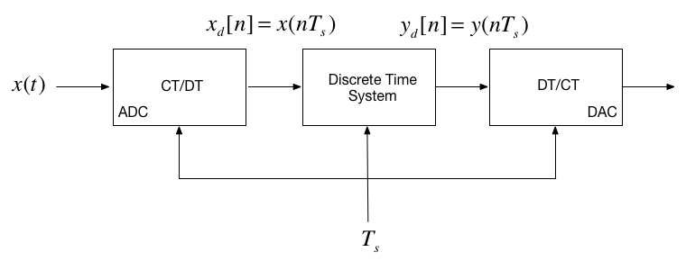

# Discrete-Time Systems and the Z-Transform

Dr Chris Jobling
([c.p.jobling@swansea.ac.uk](mailto:c.p.jobling@swansea.ac.uk)) Digital
Technium 123 Office Hours: Thursdays 14:00-15:00

You can view the notes for this presentation in [HTML format](http://nbviewer.ip
ython.org/github/cpjobling/EG-247-Resources/blob/master/week9/z-transform.ipynb)
and print using your Brower's print function. The source code of this
presentation is available as an interactive [IPython
notebook](http://ipython.org/notebook.html) from GitHub:
<https://github.com/cpjobling/EG-247-Resources>. The GitHub repository also
contains the source code for all the Matlab/Simulink examples.

## Scope and Background Reading

This session introduces the z-transform which is used in the analysis of
discrete time systems. As for the Fourier and Laplace transforms, we present the
definition, define the properties and give some applications of the use of the
z-transform in the analysis of signals that are represented as sequences and
systems represented by difference equations.

The material in this presentation and notes is based on Chapter 10 of [Steven T.
Karris, Signals and Systems: with Matlab Computation and Simulink Modelling, 5th
Edition](http://site.ebrary.com/lib/swansea/docDetail.action?docID=10547416)
from the **Required Reading List**. Additional coverage is to be found in
Chapter 13 of [Benoit Boulet, Fundamentals of Signals and
Systems](http://site.ebrary.com/lib/swansea/docDetail.action?docID=10228195)
from the **Recommended Reading List**.

## Agenda

* Introduction
* The Z-Transform
* Properties of the Z-Transform
* Some Selected Z-Transforms
* Relationship between Laplace and Z-Transform
* Stability Regions

# Introduction

## Introduction

In the remainder of this course we turn our attention to how we model and
analyse the behaviour of the central block in this picture.

## Nature of the signals

* The signals we process in discrete time systems are *sequences* of values
$x[n]$ where $n$ is an index.

A sequence can be obtained in real-time, e.g. as the output of a ADC, or can be
stored in digital memory; processed and re-stored; or processed and output in
real-time, for example in digital music.

## Nature of the systems

* The input to a discrete time system is a squences of values $x[n]$
* The output is also a sequence $y[n]$
* The block represents the operations that convert $x[n]$ into $y[n]$.
* This processing takes the form of a *difference equation*
* This is analogous to the representation of continuous-time operations by
differential equations.

## Transfer function model of a DT system

* In CT systems we use the Laplace transform to simplify the analysis of the
differential equations
* In DT systems the z-Transform allows us to simplify the analysis of difference
equations
* In CT systems application of the Laplace transform allows us to represent
systems as transfer functions and solve convolution problems by multiplication
* The z-transform provides analogous tools for the analysis of DT systems.

# The Z-Transform

## The Z-Transform

$$\mathcal{Z}\left\{f[n]\right\} = F(z) = \sum_{n=0}^{\infty} f[n]z^{-n}$$

$${{\cal Z}^{ - 1}}\left\{ {F(z)} \right\} = f[z] = \frac{1}{{2\pi
j}}\oint\limits_{} {F(z){z^{k - 1}}\,dz}$$

## Sampling and the Z-Transform

In the last lecture we showed that sampling could be represented as the
multiplication of a CT signal by a periodic train of impulses:

$$x_s(t) = x(t)\sum_{n=0}^{\infty}\delta(t-nT_s)$$

By the sampling property of $\delta(t)$

$$x_s(t) = \sum_{n=0}^{\infty}x(nT_s)\delta(t-nT_s)$$

----

Using the Laplace transform pairs $\delta(t) \Leftrightarrow 1$ and $\delta(t-T)
\Leftrightarrow e^{-sT}$ we obtain:

$$X_s(t) = \mathcal{L}\left\{\sum_{n=0}^{\infty}x(nT_s)\delta(t-nT_s)\right\} =
\sum_{n=0}^{\infty}x(nT_s)e^{-nsT_s}$$

By substitution of $z = e^{sT_s}$ and representing samples $x(nT_s)$ as sequence
$x[n]$:

$$X(z) = \sum_{n=0}^{\infty}x[n]z^{-1}$$

# Properties of the z-Transform
## Properties of the z-Transform
